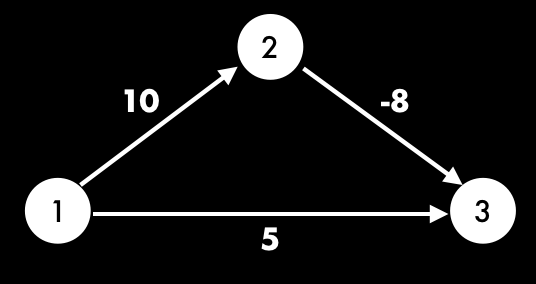
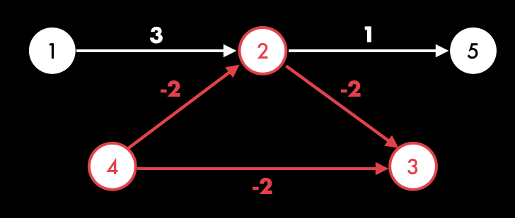

# 벨만포드 알고리즘

> 유향 그래프에서 최단 경로 구하기
이 때 간선은 `음수` 일 수 있다.



다익스트라는 1,2번 정점 중에서 더 짧은 2번을 선택한다. 2번까지 최단경로는 5로 결정된다.
잘못된 값을 결정하게된다.

벨만 포드 알고리즘은 2중 for문을 통해 모든 경우의 수를 검증한다.
바깥쪽 for문 에서는 `V-1`번 반복하고 안쪽 for문에서는 간선 개수(E)만큼 반복한다.
여기서 V-1번인 이유는 다음과 같다.
**최단 경로는 같은 정점을 두 번 지날일이 없기 때문이다.**
따라서, 최단 경로의 간선 개수는 많아야 `V-1`개다.

## 수행과정

1. 모든 정점의 최단거리(`dist[v]`)을 무한대로 초기화한다.
2. 출발점 `dist[1]`은 0으로 갱신한다.
3. 첫번째 정점과 인접한 정점의 최단거리를 갱신한다.
4. 2~V-1번째까지 3번을 반복한


이 때, 음의 간선이 존재하기 때문에 간선 (u,v)를 확인시 `dist[u]`가 INF인지 확인해야한

## 음의 사이클



위 2,3,4 정점은 음의 사이클을 형성하며 최단거리가 계속 갱신되는 문제가 발생한다.

음의 가중치가 있는 그래프에서 최단경로 구할 때 음의 사이클이 발생하면 루프를 돌면서 최단거리가 계속 갱신된다. 따라서, 음의 사이클 존재 여부만 판단하면 된다.
**루프 마지막(V번째)에 최단거리가 갱신되는 일이 있는지 확인하면 된다.**


## 구현

```C
#include <iostream>
#include <vector>
#include <stdio.h>

using namespace std;

const int INF = 1000000;

vector <pair<int, int> > edges[6001];
int dist[501];
bool isCycle;
int main() {

  int N, M, from, to, cost;

  scanf("%d %d", &N, &M);

  for(int i=0; i<M; i++){
    scanf("%d %d %d", &from, &to, &cost);
    edges[from].push_back(make_pair(to, cost));
  }

  fill_n(dist, N+1, INF);
  dist[1] = 0;

  for(int i=1; i<=N; i++){

    for(int j=1; j<=N; j++){

      for(int k=0; k<edges[j].size(); k++){
        int next = edges[j][k].first;
        int cost = edges[j][k].second;

        if(dist[j] != INF && dist[next] > dist[j] + cost){
          dist[next] = dist[j] + cost;
          if(i==N){
            isCycle=true;
          }
        }
      }

    }
  }

  if(isCycle){
    puts("-1");
  }
  else{
    for(int i=2; i<=N; i++)  {
      if(dist[i] == INF) puts("-1");
      else printf("%d\n", dist[i]);
    }
  }

  return 0;
}
```


## 관련 문제
