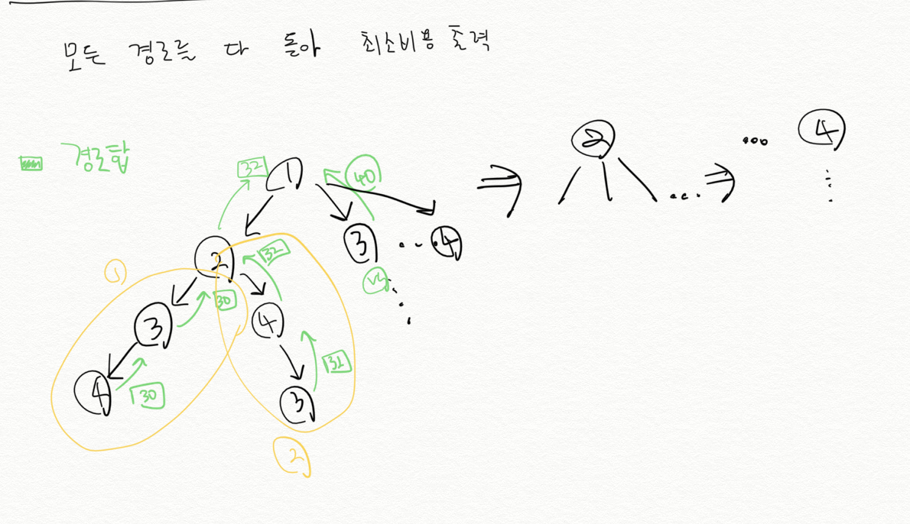

# 최적화

앞에서 다룬 문제는 문제의 답이 **하나가 아닌 여러 개** 였다. 그 중에서 **어떤 기준에 따라 가장 좋은 답을 찾아 내는 문제들을 통칭해 최적화 문제**라고 부른다. 

n개의 원소 중에서 r개를 순서 없이 고르는 방법의 수를 계산하는 것은 최적화 문제가 아니다. 

n개의 사과 중 r개를 골라서 무게의 합을 최대화 하는 문제 혹은 가장 무거운 사과와 가벼운 사과의 무게 차이를 최소화하는 문제 등은 최적화 문제가 된다. **사과를 골라내는 방법은 여러 가지인데, 이 중 특정 기준에 의해 가장 좋은 답을 고르는 문제이기 때문이다.**

최적화를 해결하기 위해 여러가지 방법이 있지만 가장 기초적인 것은 완전탐색이다. 

## 예제: TSP(외판원 문제)

한 도시에서 출발해 다른 도시들을 전부 한번씩 방문한 뒤 시작도시로 돌아오려고 한다. 이 때, 가능한 경로 중 가장 짧은 경로는?

### 무식하게 풀기

#### 완전탐색으로 풀기 위한 전제 조건

1. 시간 안에 답을 구할 수 있는지

0번 도시부터 출발하여 남은 도시들을 순서대로 방문하면 `(n-1)!`가지 방법이 있다. 도시가 최대 10개라면 9! 이므로 36만 개 정도 된다. 1초안에 가볍게 처리 가능하다.

#### 재귀 호출을 통한 답안 생성

재귀 호출을 이용해 간단하게 답을 만들 수 있다. n개의 도시로 구성된 경로를 n개의 조각으로 나눠, 앞에서부터 도시를 하나씩 추가해 경로를 만들 수 있다. 

**`shortestPath(path) = path`가 지금까지 만든 경로 일 때, 나머지 도시들을 모두 방문하는 경로 중 가장 짧은 것의 길이를 반환**한다. 

```C
int n;
int dist[100][100];
bool visited[100];

// 나머지 도시들을 모두 방문하는 경로들 중 가장 짧은 것의 길이를 반환.
int getMinLength(vector <int> &pathList, int sumOfLen) {
    if(pathList.size() == n) {
        return sumOfLen + dist[pathList.back()][pathList[0]];
    }
    
    int answer = numeric_limits<int>::max();
    int ret;
    
    for(int i =0; i<n; i++) {
        int here = 0;
        if(visited[i]) {
            continue;
        }
        if(pathList.size() > 0) {
            here = pathList.back();
        }
        
        pathList.push_back(i);
        visited[i] = true;
        
        ret = getMinLength(pathList, sumOfLen + dist[here][i]);
        
        answer = min(ret, answer);
        
        for(int j = 0; j<4;j++){
            cout<<pathList[j]<<" ";
        }
        
        cout<<answer<<endl;
        
        pathList.pop_back();
        visited[i] = false;
    }
    return answer;
}
```



## summary

여러개의 정답 중 가장 좋은 답을 찾는 문제는 최적화문제다. 여러 개의 정답을 무식하게 풀기로 찾았다. 한단계 더 나아가 여러개의 정답을 구할 때마다 가장 좋은 답을 찾기 위해 무식하게 풀기 방법을 사용할 수 있다. 

> TSP
> 모든 도시를 모두 방문할 때 최소 길이는?
> 무식하게 풀기를 통해 모든 도시를 방문할 때마다 최소 길이를 반환받아 비교한다. 