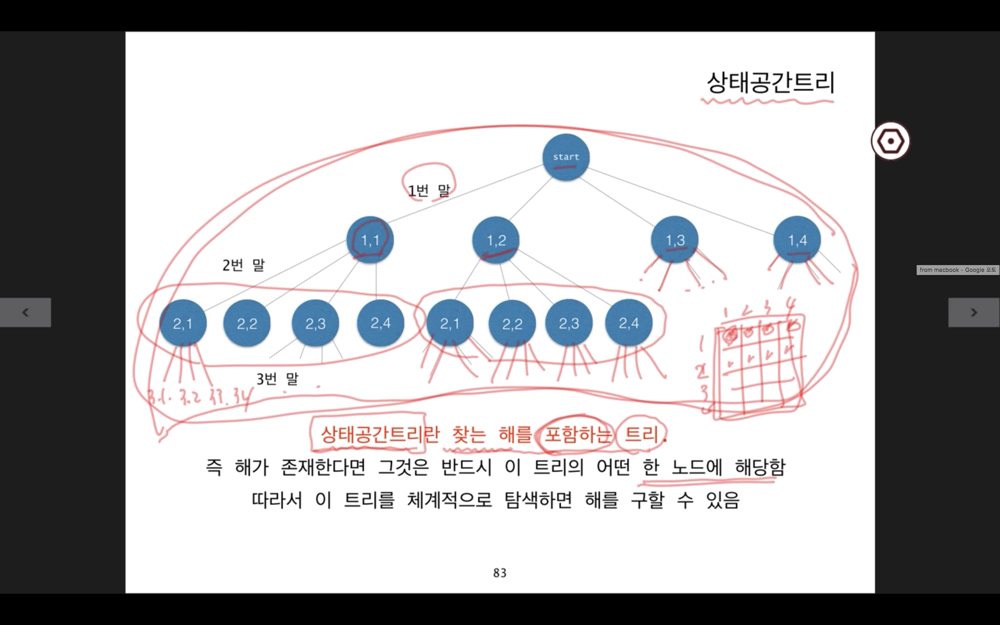
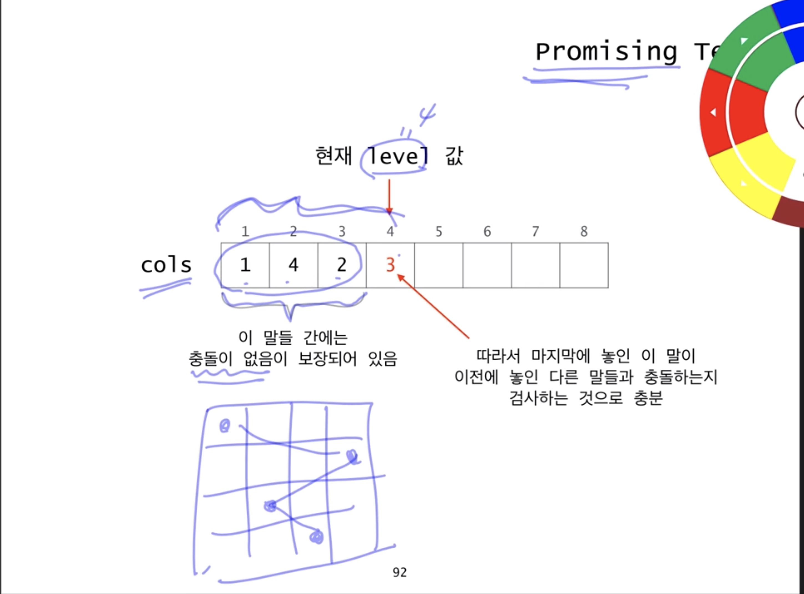
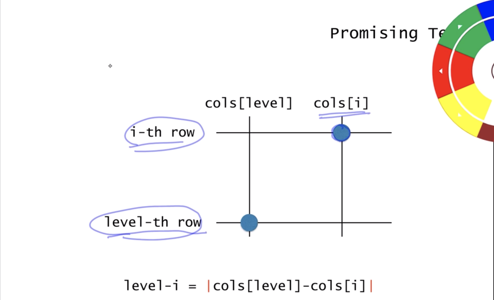

# 6. recursion 응용

**BackTracking**
어떤 결정을 하다가 막다른 골목(조건 불만족, 답을 못찾음)일 경우 가장 최근에 내린 결정을 번복하여 다시 진행

## 상태공간트리

**상태 공간 트리란 찾는 해를 \*\***함하는 트리\*\*
해가 존재한다면 반드시 이 트리의 어떤 한 노드에 해당
따라서 이 트리를 체계적으로 탐색할 경우 해를 발견 가능



## Backtracking

- 상태 공간 트리를 DFS 방식으로 탐색하여 해를 찾는 알고리즘


how to implement

- recursion
  - 얘가 더 쉽고 간명
- stack]

```
return-type queens (arguments) {
  if non-promising
    report fail and return;
  else if success
    report answer and return;
  else
    visit children recursively
}
```

- arguments
  - 현재 어떤 트리의 어떤 노드에 있는지를 지정

## queens 문제를 설계 해보자

```java
int[] cols = new int [N+1];

boolean queens (int level) {
  if (!promising(level))
    report fail and return;
  else if (level == N)
    return true;
  else {
    // visit children recursively
    for (int i = 1; i <= N; i++) {
      cols[level+1] = i;
      if(queens(level + 1))
        return true;
    }
    // n번 다 돌아봤는데 다 실패 그니까 false
    return false;
  }
}
```

- 매개변수 level은 현재 노드를 표현
- `cols[i]=j`는 i번 말이 (i행, j열)에 놓였음을 의미
- 성공이냐 실패를 반환
- 마지막 else 에서는 리커시브하게 자식 노드 queens 함수 호출
  - 근데 4번 다 돌아봤는데 true가 리턴안되면 false 리턴해야함. 즉, backtracking 시도.

_promising-test_



```java
boolean promising (int level) {
  for(int i = 1; i< level; i+=1) {
    if (cols[i] == cols[level]) return false;
    else if (level - i == Math.abs(cols[level] - cols[i])) // 같은 대각선에 놓였는지
      return false;
  }
  return true;
}
```

같은 대각선에 있는지 알 수 있는 방법



## Summary

**backtracking**

- 어떤 결정 하다가 잘못됐다싶으면 최근에 내린 결정 번복
  - 상태 공간 트리를 DFS로 탐색하여 해 찾기
- 상태공간트리
  - 해가 존재한다면 반드시 이 트리의 어떤 한 노드에 해당됨
  - 따라서 이 트리를 체계적으로 탐색하면 해 발견 가능

```
return-type queens (arguments) {
  if non-promising // 다음 자식 노드로 리커시브 진행할지 여부 결정
    report fail and return;
  else if success
    report answer and return;
  else
    visit children recursively
}
```

**내가 풀어본 nqueens**

```C
int size;
bool table[4][4];
bool isExistNQueen;

bool isSatisfyQueens(int row, int col) {
    for(int i = row-1; i >= 0; i--) {
        if(table[i][col]) {
            return false;
        }
    }

    int r = row;
    int c = col;

    while(r>0 && c>0) {
        r--;
        c--;
        if(table[r][c]) {
            return false;
        }
    }

    r=row;
    c=col;

    while(r>0 && c<size - 1) {
        r--;
        c++;
        if(table[r][c]) {
            return false;
        }
    }

    return true;
}

void placeQueen(int row, int col) {
    // 실패하면 return;
    if (isSatisfyQueens(row, col) == false || isExistNQueen) {
        return;
    }
    // 마지막 row라면 출력 후 return;
    else if (row == size - 1) {
        isExistNQueen = true;
        for(int i = 0; i<size; i++) {
            for(int j = 0; j<size; j++) {
                if(table[i][j]) {
                    cout<<"1"<<' ';
                } else {
                    cout<<"0"<<' ';
                }
            }
            cout<<endl;
        }
        return;
    }
    // 마지막 로우가 아니라면 visit recursively children
    else {

        if(row + 1 >= size) {
            return;
        }
        for(int i = 0; i<4; i += 1) {
            table[row + 1][i] = true;
            placeQueen(row + 1, i);
            table[row + 1][i] = false;
        }
    }
}

int main(int argc, const char * argv[]) {

    size = 4;

    placeQueen(-1, 0);

    return 0;
}
```
