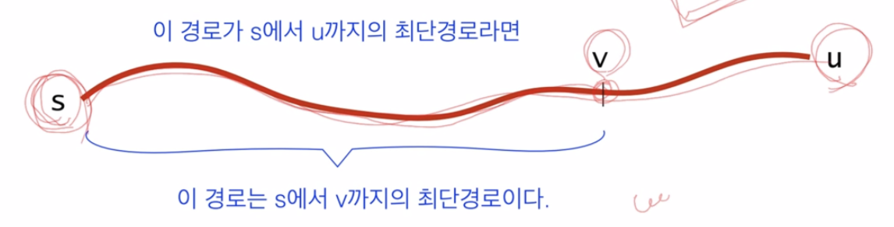
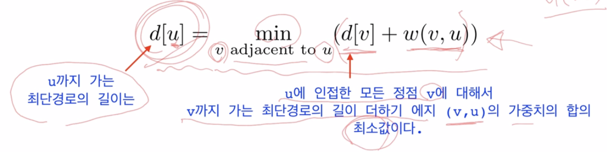
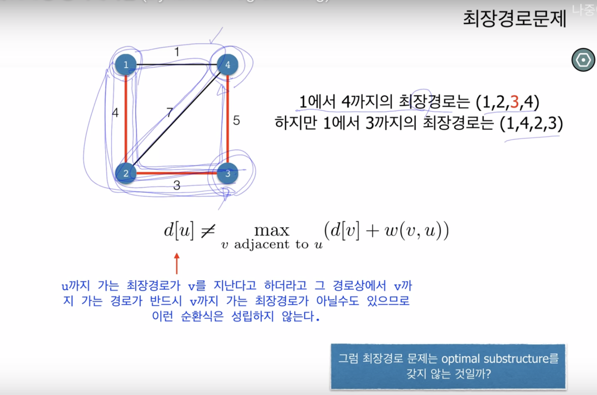

# 동적계획법

1. 일반적으로 **최적화 문제** 혹은 **카운팅 문제** 에 적용됨.
2. 주어진 문제에 대해 순환식을 정의
3. 순환식을 memoization or bottom-up으로 풀이.

- 최적화 문제
  - 최소값, 최대값 구하는거
  - 근데 최단경로가 최소값은 아님. 경로의 최소 길이를 구하는 거라 똑같은 문제가 아닐 수 있음.

## 핵심 : 순환식

동적계획법의 핵심은 순환식.

- subproblem들을 풀어서 원래 문제를 푸는 방식. 그런 의미에서 분할정복법과 공통성이 있음.

> 순환식이란?
> 예를 들어, `L[i][j] = min( L[i-1][j], L[i][j-1] ) + path[i][j];`
> original problem을 subproblem들을 풀어서 해결

- 분할정복법에서는 분할된 문제들이 서로 disjoint하지만 동적계획법은 그렇지 않음.

- 즉 서로 overlapping 하는 subproblem들을 해결하여 원래 문제를 해결.
  - `f(n) = f(n-1) + f(n-2)`
  - n-1에 관한 문제와 n-2에 관한 문제 즉, 2개의 subproblem의 문제를 해결 및 조합하여 original problem에 대한 해답을 구함.

### Optimal substructure인지 확인하는 질문

Optimal Substructure의 중요한 건 **순환식을 어케 세우는 것** 이냐이다.
그거슨 **최적해의 일부분이 그 부분에 대한 최적해인가?** 이다.

최단경로 문제로 예를 들어보자.

**순환식은 optimal substructure를 표현**

d[v]라고 쓸 수 있는 이유는 d[v]가 최적해이기 때문.
즉, d[u]에 대한 최적해는 d[v] + w(u,v)인데, d[v]는 d[u] 부분에 대한 최적해여야함.

#### 최장 경로 문제

- 노드를 **중복 방문하지 않고** 가는 가장 긴 경로
- optimal substructure를 가지는가?

- 순환식을 세우기 위한 젤 처음 해야 하는 질문
  - **이 문제에 대한 최적해의 일부분이 그 부분에 대한 최적해인가?**
  - 근데 이 특성이 당연히 성립되지 않음 (아래 그림 보자)

- 그럼 최장경로 문제는 optimal substructure를 갖지 않는 걸까?
- 그런건 아님.

## Summary

- 최적화, 카운팅과 같은 문제에 적용됨.
- 주어진 문제에 대해 순환식을 정의(가장 중요)
- 순환식을 memoization or bottom-up으로 풀이

**핵심은 순환식.**

- subproblem들을 풀어서 original 문제(더 큰 문제)를 푸는 방식.
  - 최단경로 문제를 생각해보자. `L[i][j] = min(L[i-1][j], L[i][j-1]) + path[i][j]`
  - 피보나치를 생각해보자. `f(n) = f(n-1) + f(n-2)`

그렇다면 어케 DP인지 즉, Optimal substructure인지 알 수 있을까?
**구하고자 하는 최적해의 일부분이 그 부분에 대한 최적해인가** 로 설계가능 할 수 있어야함.
