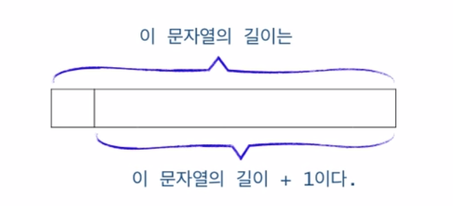

# 2. 순환적으로 사고하기

## 문자열의 길이 계산 (틀림)



```
if the string is empty
    return 0;
else
    return 1 + 첫번째 char를 제외한 스트링의 길이
```

```
int length (string str) {
    if(str.compare("") == 0){
        return 0;
    }
    return 1 + length(str.substr(1))
}
```

## 문자열의 프린트

```
printChars(String str) {
    if(str.size() == 0) return ;

    cout<<str[0];
    printChars(str.substr(1));
}
```

## 문자열을 뒤집어 프린트 (틀림)


```C
printReverseChars(String str) {
    if(str.size() == 0) return;

    // cout<<str[str.size()];
    // printChars(str.substr(0, str.size() - 2))

    printReverseChars(str.substr(1));
    cout<<str[0];
}
```

위 코드와 다른점은 문장의 순서

- 먼저 전부다 쪼갠 다음
- 차례대로 출력

## 2 진수로 변환하여 출력 (틀림)

```C
void printInBinary(int n) {
    if (n<2) cout<<n;
    else {
        printInBinary(n / 2);
        cout<<n%2;
    }
}
```

## 배열의 합 구하기 (틀림)

```
int sum(int n, int [] data) {
    if(n <= 0) {
        return n;
    }
    return sum(n-1, data) + data[n-1];
}
```

## 데이터파일로 부터 n 개의 정수 읽어오기

Scanner in 이 참조하는 파일로부터 n 개의 정수를 입력 받아
배열 data 의 `data[0], ... data[n-1]`에 저장함

```C
void readFrom(int n, int [] data, Scanner in) {

}
```


## Recursion VS Iteration

- 모든 순환함수는 반복문으로 변경 가능
- 그 역도 성립. __모든 반복문은 recursion으로 표현 가능__
- __순환함수는 복잡한 알고리즘을 단순하고 알기 쉽게 표현__
- 하지만 함수 호출에 따른 오버헤드가 있음(매개변수 전달, activation frame 생성 등)