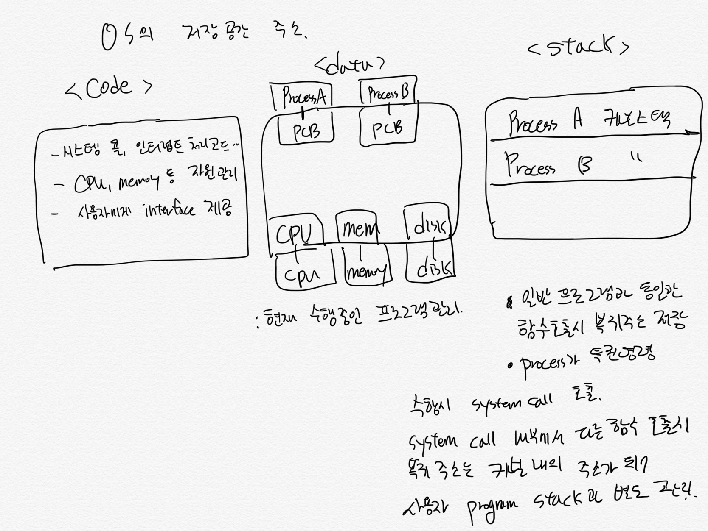

## 4. 인터럽트의 원리

## 4.1 프로그램 구조와 인터럽트

## 4.2 컴퓨터 시스템 작동 개요

CPU 는

- 빠른 처리 속도로 계산만 함.
- 어떤 작업을 수행해야 하는지 스스로 결정 못함.
- CPU 는 현재 수행해야 할 `메모리 주소`의 명령을 있는 그대로 처리함
  - 이러한 주소를 담고 있는 레지스터를 **프로그램 카운터** 라고 함

컴퓨터 시스템의 동작은 CPU 에 의해서만 이루어지는 건 아님

프로그램이 수행되는 중에

- 디스크에서 파일 읽어오기
- 키보드로부터 입력 받기
- 처리 결과를 화면에 출력하기

위와 같이 CPU 에서 명령을 수행하는 부분, 컴퓨터 외부와 입출력이 이루어지는 부분.

일단 총체적인 이해부터 해보자.

- 하드웨어로 작은 CPU 와 메모리가 있음
- 각 입출력 장치
  - 이들 장치를 전담하는 CPU 와 메모리를 각각 **입출력 컨트롤러** , **로컬 버퍼** 라고 함

---

### CPU 가 수행하는 명령

1. 일반명령
2. 특권명령

일반명령

- 메모리에서 자료 읽어와서 CPu 에서 계산하고 결과를 메모리에 쓰는 일련의 ㅁ여령들
- 모든 프로그램이 수행할 수 있는 명령

특권 명령

- 보안이 필요한 명령으로 `입출력 장치`, `타이머` 등 각종 장치를 접근하는 명령

컴퓨터 시스템은 이 두 명령의 실행 가능성을 체크하기 위해 CPU 내에 **mode bit** 를 둔다

사용자 프로그램이 특권 명령이 필요한 경우 System Call 호출.
예를 들어, CPU 가 컨트롤 레지스터를 세팅하여 디스크 컨트롤러에게 데이터를 읽어오라고 명령 내리면,

- 디스크 컨트롤러는 디스크로부터 데이터 읽어와서 로컬 버퍼에 저장
- 저장 완료 도면 디스크 컨트롤러가 CPU 에게 인터럽트 발생시켜 입출력 작업 완료 알림

...

## 4.3 프로그램의 실행

1. 디스크에 존재하던 실행 파일이 메모리에 적재
2. 프로그램이 CPU 를 할당받고 기계 명령을 수행하는 상태

보통 CPU 가 1 개니까 CPU 에서 명령을 수행하는 프로그램은 1 개

- 여러 프로그램이 **메모리에 동시에 적재** 되어 있을 수 있으므로 여러 프로그램이 동시에 실행된다는 말을 보편적으로 사용

실행 파일이 메모리에 적재시 실행 파일 전체가 메모리에 한꺼번에 안올라감

- 필요한 부분만 적재
- 필요하지 않은 부분은 swap area 에, 필요할 때 적재시킴

프로세스의 **주소 공간** 은

- code
- data
- stack

으로 구성된다. 각 프로그램은 주소 공간을 별도로 가짐.
이 주소공간을 **가상 메모리** 혹은 **논리적 메모리** 라고 부름

- 이는 실제 물리적 메모리의 주소와 독립적으로 각 프로그램마다 독자적인 주소 공간을 가지기 때문에 위와 같이 부름

---

OS 도 1 개의 프로그램이므로 운영 체제 커널 역시

- code
- data
- stack 을 가짐

커널이 하는일

- CPU, 메모리 등 자원 관리하기 위한 부분
- 사용자에게 편리한 인터페이스 제공하기 위한 부분
- 시스템 콜 및 인터럽트를 처리하기 위한 부분

커널의 데이터 영역은

- **현재 수행중인 프로그램을 관리하기 위한 자료구조도 커널 데이터 영역에 유지**
- 각 프로세스의 상태, CPU 사용 정보, 메모리 사용 정보 등을 유지하기 위한 자료구조인 PCB 를 가짐
- hw/sw 를 포함하는 시스템 내의 모든 자원을 관리하기 위한 자료구조 각각 유지

커널의 스택 영역은

- 일반 프로그램과 마찬가지로 함수 호출시의 복귀 주소 영역을 저장하기 위함
- 커널의 스택은 일반 사용자 프로그램의 스택과 달리 현재 수행중인 프로세스마다 별도의 스택을 두어 관리
- 즉, 자기 코드 내에서 함수 호출 및 복귀 주소를 유지하기 위해서는 자기 주소 공간 내의 스택 사용
- 시스템 콜 등 커널 내의 함수를 호출하는 경우에는 커널의 주소 공간에 존재하는 커널 스택을 사용
  - **프로세스가 특권 명령을 수행하려고 커널에 정의된 시스템 콜을 호출하고 시스템 콜 내부에서 다른 함수를 호출하는 경우 그 복귀 주소는 커널 내의 주소가 되어 사용자 프로그램의 스택과는 별도의 저장 공간이 필요**
  - 커널은 일종의 공유 코드로써 모든 사용자 프로그램이 시스템 콜을 통해 커널의 함수를 접근할 수 있으므로 각 프로세스마다 커널 내의 별도의 스택을 둔다



## 4.4 사용자 프로그램이 사용하는 함수\호
## 4.5 인터럽트

인터럽트는 하드웨어 인터럽트, 소프트웨어 인터럽트 있음(보통 hw인터럽트를 통칭)

CPU가 아닌 다른 하드웨어 장치가 
- CPU에게 어떤 사실 알리거나
- CPU의 서비스를 요청해야 할 경우 CPU의 인터럽트 라인을 세팅해 발생시킴
    - CPU는 프로그램 카운터가 가리키고 있는 지점의 명령을 하나씩 수행 후,
    - 다음 명령 수행 전에 인터럽트 라인 체크 하여 인터럽트 발생했으면 현재 수행하던 프로세스 멈추고 
    - OS의 인터럽트 처리루틴으로 이동하여 인터럽트 처리 수행
- 타이머도 마찬가지 

넓은 의미의 인터럽트

1. hw 인터럽트
2. 트랩
    - 소프트웨어가 발생하는 인터럽트
    - exception : 프로그램이 허용되지 않는 연산 수행하려 할 때, OS가 CPU 제어권을 가지고 상황 조치
        - 0으로 나누는 연산
        - 자신의 주소 공간 넘어서는 메모리 참조
    - system call :  사용자 프로세스가 OS의 서비스를 요청하기 위해 커널의 함수를 호출 하는 것

## 4.6 시스템 콜

CPU는 매 시점 프로그램 카운터가 가리키고 있는 메모리 주소의 명령을 수행.
- 컴퓨터 시스템에서는 hw/sw 자원의 보안을 위해 CPU가 실행할 수 있는 명령을 일반 명령과 특권 명령으로 나누어 관리
- 예를 들어 입출력 장치 접근하는 명령은 특권 명령으로 규정.
- 디스크에 있는 남의 파일 보기 등과 같은 __입출력 장치에 대한 접근을 사용자 프로세스가 직접하지 못하도록 제한__.

이러한 관리를 지원하기 위해 하드웨어 측면에서 모드 비트라는게 있음

---
;;;
---

CPU를 할당받고 명령을 수행하다 CPU에 선점당하는 경우

1. 타이머에 의해 인터럽트 발생
2. 입출력 요청을 위해 시스템 콜을 한 경우

## 4.7 프로세스의 상태

1. 실행(running)
2. 준비(ready)
    - 프로세스가 CPU를 할당받지 못한 상태

3. 봉쇄(blocked, wait, sleep)
    - 프로세스가 CPU 할당 받아도 명령 수행 불가.
    - 프로세스가 요청한 입출력 작업이 진행중인 경우

### 2(준비) -> 1실행(running)

- 현재 실행상태에 있는 프로세스가 입출력 요청 등으로 봉쇄되거나 
- 실행 상태에 있던 프로세스의 CPU 할당 시간이 만료되어 타이머 인터럽트 발생한 경우

OS는 준비 상태에 있는 프로세스들을 줄 세우기 위해 __준비 큐(ready queue)__ 를 가짐
- 제일 앞 줄에 있는 프로세스에게 제일 먼저 CPU를 할당

> 준비큐에 프로세스 줄 세우는 방법은 CPU 스케줄링 방법에 따라 다름 (6장)

### OS는 특정 프로세스 줄 세우기 위해 자원별로 큐를 두고 있음

1. 레디 큐
2. 디스크 입출력 큐
    - 디스크에 입출력 서비스를 요청한 프로세스들
    - 디스크 컨트롤러는 디스크 입출력 큐에 줄 서 있는 순서대로 프로세스들의 입출력 작업 수행
    - 입출력 작업 완료시 디스크 컨트롤러가 CPU에게 인터럽트 발생시킴
    - 인터럽트 처리 루틴에 의해 디스크 입출력이 완료된 프로세스는 입출력 큐에서 빠져나와 CPU를 기다리는 __레디큐__ 에 줄선다.
3. 키보드 입출력 큐
    - 키보드로부터 어떤 입력 받아야 하는 경우

프로세스들을 줄세우기 위한 큐

__프로세스의 상태 관리는 커널의 주소 영역 중 `데이터` 영역에 다양한 큐를 두어 이뤄짐__
각 프로세스들이 
- CPU를 기다리는지
- 입출력을 기다리는 지 등을 커널이 총체적으로 관리
    - 예컨대 타이머 인터럽트 발생시 커널은 데이;터 영역에 있는 레디 큐의 정보를 참조에 다음에 어느 프로세스에게 CPU를 할당할지 결정하고
    - 현재 실행되던 프로세스는 준비 큐의 제일 뒤로 보냄

## 4.8 프로세스의 2가지 상태

```
A의 주소공간          Kernel의 주소공간  A의 주소 공간
user mode           kernel mode       user mode
------------------> --------------> -------------->
  | user defined    | system call   |     | library function call
    function call                   |
                                return from kernel
```


