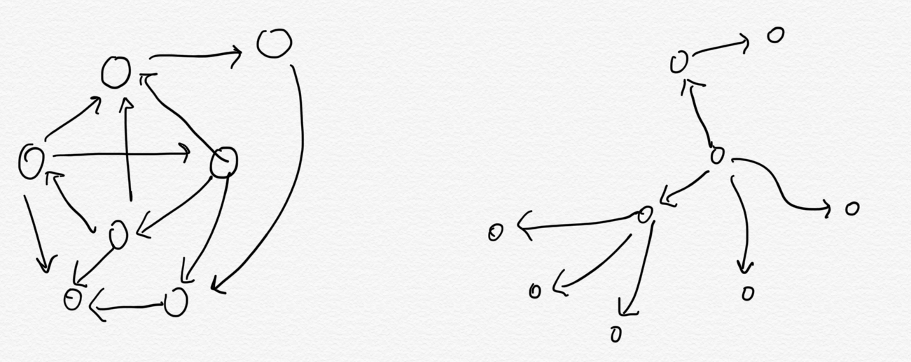
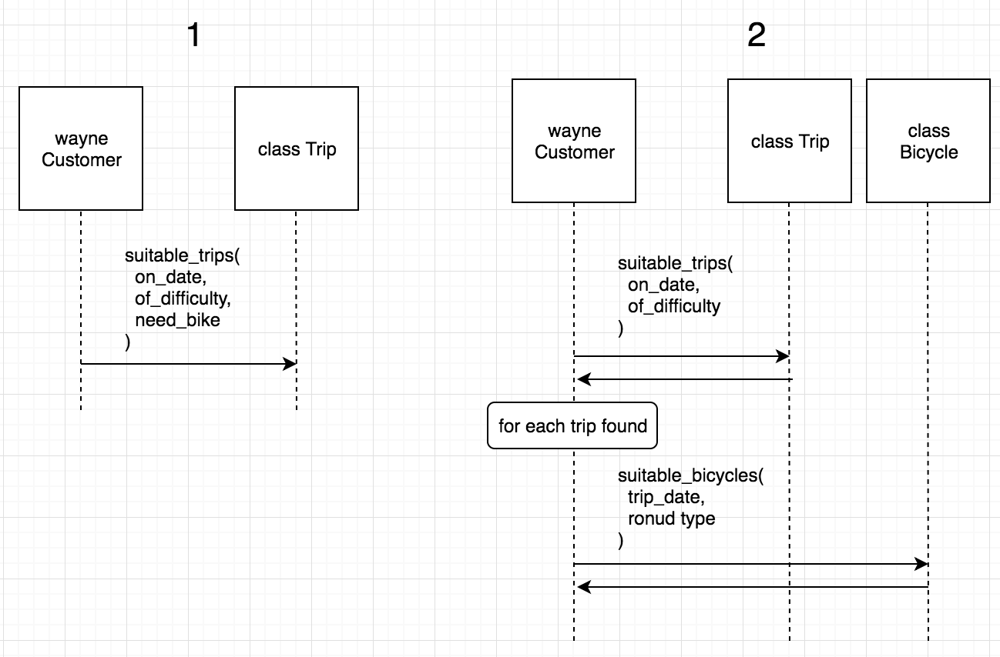

# 4. 유연한 인터페이스 만들기

- 애플리케이션은 클래스로 구성되지만 메시지를 통해 정의됨
- 애플리케이션의 움직임을 반영하는 것은 메시지

객체가 무엇을 아는지(객체의 책임), 누구를 알고 있는지(객체의 의존성) 뿐만 아니라
**서로 어떻게 소통하는지** 알아야 함

**객체 사이의 소통은 인터페이스를 통해 이뤄짐**
애플리케이션이 자라나고 변형될 수 있도록 해주는 유연한 인터페이스에 대해 알아보자

## 4.1 인터페이스 이해하기

첫번쨰 애플리케이션 객체는 재사용하기 어려움

- 자기 자신을 너무 많이 드러냄
- 주변 객체에 대해 너무 많이 알고 있음
- 독립적으로 존재하는 객체 없음
- 하나를 재사용하려면 전체를 사용해야함
- 하나 수정시 전체 수정

위 문제의 핵심은 클래스가 **무엇을 하는지** 가 아닌 **무엇을 드러내는지** 임

- 클래스의 모든 메서드는 다른 객체가 언제든 호출하기 쉬운 대상

두 번쨰 어플리케이션 객체는 어떤 메시지를 주고받을지에 대한 합의가 있음

- 각 객체는 다른 객체가 사용해도 되는 메서드 묶음을 잘 정리함
- 밖으로 노출된 메서드가 클래스의 **public interface** 를 구성

### 인터페이스란

여러가지 의미를 가짐

1. 위 예제에서는 클래스 안에 있는 인터페이스 지칭

- 클래스는 메서드를 구현

2. 하나의 클래스로부터 독립되어 있고 여러 클래스 사이를 돌아다니는 인터페이스

- 메시지의 묶음
- 메세지들 자체가 인터페이스를 정의
- 마치 인터페이스가 가상의 클래스를 정의하는 것과 같음

## 4.2 인터페이스 정의하기

레스토랑의 부엌을 예로 들자.

식당에는 손님이 사용할 수 있는 public interface, 즉 메뉴판
부엌안에서는 많은 일이 오가지만 private 하기에 손님에게 보이지 않음

퍼블릭과 프라이빗의 구분은 일을 가장 효율적으로 처리하기 위함

- 손님이 직접 요리 과정을 감독하면, 식재료가 부족하여 다른 요리 추천해야 할 때마다 손님을 새로 교육 시켜야함
- 메뉴판을 이용하기 때문에 손님은 부엌에서 어떻게 요리하는지 모르면서 주문 가능

클래스는 마치 이런 부엌과 같음

- 1개의 책임을 제대로 수행하기위해 존재하며
- 수많은 메서드를 구현

어떤 메서드는

- 우리 클래스의 메뉴판과 같은 역할이므로 퍼블릭 메서드
- 자잘한 내부 구현에 관여하기 때문에 프라이빗 메서드

### 4.2.1 퍼블릭 인터페이스

- 클래스의 핵심 책임을 드러냄
- 다른 객체에 의해 호출됨
- 쉽게 변경 안됨
- 다른 객체가 안정적 의존 가능
- 테스트를 통해 문서화됨

### 4.2.2 프라이빗 인터페이스

- 세부 구현 담당
- 다른 객체에 의해 호출 안됨
- 필요에 따라 언제든 변경 가능
- 다른 객체가 의존하기에 위험
- 테스트에서 다루지 않을 수도 있음

### 4.2.3 책임, 의존성 그리고 인터페이스

클래스의 퍼블릭 인터페이스는 클래스의 구체적인 책임을 표현한 문장과 상응(책임을 명시한 계약서)

## 4.3 퍼블릭 인터페이스 찾기

디자인의 목표는 당장의 요구사항을 처리하기에 충분하면서 나중에 수정할 여지 남기는 것

### 4.3.1 예시: 자전거 여행 회사

여행회사가 여행객에게 자전거 여행길 추천,
자전거는 회사꺼가 부족할 시 지역 점포들과 공유

애플리케이션의 **명사, 정보, 행동** 을 기반으로 클래스를 떠올려보면

- 여행객
- 여행
- 여행길
- 자전거
- 정비공

이를 **도메인 객체** 라고 부름

도메인 객체에만 집착하면 행동들을 객체 속에 넣어버림
도메인 객체들이 주고 받는 **메시지** 에 주목해야함
이 메세지들은 새로운 겍체를 찾도록 도움

### 4.3.3 시퀀스 다이어그램 사용하기

UML은 그 중 하나임

- 객체들의 배치
- 메시지 전송 전략
  에 대해 검토 가능

wayne은 Trip에게 `suitable_trips` 메세지를 전송하여 결과만 돌려받음

위 이미지에서 질문을 던져보자.
- 여행에 적당한 자전거가 준비되어 있는지 파악하는 것이 Trip의 책임일까?
  - 이 수신자가 이 메시지에 반응하 책임을 가지고 있는가?

> 위와 같이 다이어그램을 사용하면
> "이 클래스가 필요한건 알겠는데 __이 클래스는 무엇을 해야하지?__ " 가 아닌
> "메시지를 전송해야 하는데 누구에게 전송하지? 라고 질문할 수 있음, 즉 메시지 기반 디자인 가능

여튼 위와 같은 질문에 대해
- 여행에 어울리는 자전거를 파악하는 것은 Trip이 아닌 Bicycle일듯
  - Trip은 sutiable_trips에, Bicycle은 suitable_bicycle을 처리해야할 책임 있음

정리하자면 wayne은

- 여행지 목록을 얻고자함
- suitable_trips 메세지를 구현하고 있는 객체를 가짐

__개선해보자__

__(2)__

- wayne은 여행지 목록을 얻고자함
- suitable_trips 메세지를 구현하고 있는 객체가 있음
- suitable trips를 찾기 위해 suitable_bicycles도 골라야 함
- suitable_bicycles 메시지를 구현하고 있는 또 다른 객체가 있음

이번에는 Trip에서 추가적인 책임을 걷어냈지만
- 이 책임을 단지 customer로 옮겨놓았을 뿐임
- 자신이 무엇을 원하는지 알아야하고
- 다른 객체들이 어떻게 협업해야 하는지도 알아야함
- 즉, Customer 클래스는 자신의 책임이 아닌 거까지 직접 관리하고 있음(손님이 메뉴판을 보고 음식을 주문하는게 아닌 직접 부엌에 들어가 요리하는 것)

### 4.3.4 어떻게 해야하는지 말해주지 말고 어떤 것을 달라고 요구하기

- 송신자가 원하는 것을 요구하는 메시지
- 수신자가 어떻게 해야하는지 알려주는 메시지

이 두 종류를 구분하는 것이 매우 중요
그래야 잘 정의된 퍼블릭 인터페이스를 가진, 재사용이 가능한 클래스를 만들기 위한 핵심

trips, bicycles, mechanics를 다루는 새로운 예시를 보자.

여행이 시작되려면 모든 자전거가 잘 정비되어 있는지 확인해야함
- Trip은 자전거를 어떻게 준비해야 하는지 알고 있을 수도 있고
- Mehcanic에게 이 작업들을 요청할 수 있음

위 그림은
- Trip의 퍼블릭 인터페이스는 bicycles 메서드를 포함
- Mechanic의 퍼블릭 인터페이스는 clean_bicycle, pump_tires, lube_chain, check_brakes 메서드를 포함
- Trip은 clean_bicycle, ... 메서드를 가지고 있는 객체를 필요로 함

위 설계의 문제점은
- Trip은 Mechanic이 하는 세세한 작업을 다 알고 있음
  - 마치 Trip이 메인 프로그램
  - Mechanic은 호출할 수 있는 함수 덩어리 같음
  - 자전거를 준비하려면
    - Trip을 사용하거나
    - 중복 코드를 만들 수 밖에 없음
  - Trip은 거대한 맥락속에 위치함
  - Trip과 Mechanic은 서로 의존성이 너무 강함

__개선해보자(1)__

위 그림은
- Trip의 퍼블릭 인터페이스는 bicycles 메서드를 포함
- Mechanic의 퍼블릭 인터페이스는 prepare_bicycle 메서드를 포함
- Trip에게는 prepare_bicycle 메서드를 가지고 있는 객체가 필요

전 설계보다 개선된 점은
- Trip은 여러 책임을 Mechanic에게 넘김
  - __어떻게__ 와 관련된 책임이 모두 Mechanic에게 넘어감
  - 나중에 Mechanic을 보완하더라도 Trip은 언제나 원하는 결과를 얻음
- Mechanic에 포함된 퍼블릭 인터페이스 양이 줄음
  - 즉, 다른 객체가 의존할 수 있는 메서드 감소
  - Mechanic이 퍼블릭 인터페이스 변경할 가능성 낮춤

하지만 문제는
- Trip은 여전히 Mechanic에 대해 너무 많이 알고 있음
  - 즉, Trip은 불필요한 맥락에 있음
    - 언제나 prepare_bicycle 메서드에 반응하는 객체를 필요로 함

__개선해보자(2)__

### 4.3.5 주어진 맥락에서 독립적일 수 있게 하기

Trip이 다른 객체에 대해 알고 있다는 사실이 맥락(context)을 구성
- Trip은 prepare_bicycle 메시지에 반응할 수 있는 Mechanic 객체를 필요로 함
- 즉, Trip을 사용하려면 특정 맥락을 필요로 함
  - 언제나 자전거를 준비해야하며
  - Mechanic에게 언제나 prepare_bicycle 메세지를 전송해야 함
  - 이 메서드에 반응하는 Mechanic처럼 작동하는 객체 없으면 Trip 사용 불가

가능한 최고의 상황은
- 자신의 맥락으로부터 완전히 독립하기
- 다른 객체가 누구인지, 그들이 뭘 하는지 전혀 모른 채로 협업할 수 있는 객체는 참신하게 재사용 가능
  - 누군지 모르는 객체와 협업하는 방법: 의존성 주입

일단 상황을 다시보자
- Trip이 Mechanic에게 Bicycle 준비하라고 요청하는 건 불가피

이 문제에 대한 해결책은
- __어떤 것__ 과 __어떻게__ 사이의 구분
- Trip이 원하는 것을 정확히 보자.
  - __자전거를 준비해야 한다 는 것은 Trip이 원하는 어떤 것이 아닌, Trip을 어떻게 준비해야 하는가 이다__

- prepare_trip(self): Trip은 Mechanic에서 자신이 원하는 것(여행을 준비해야함)만 말하고
  - 자기자신을 인자로 넘김
- 이어서 Mechanic은 Trip을 호출하여 Trip이 원하는 bicycles 목록을 얻어옴

위 그림에서
- Trip의 퍼블릭 인터페이스는 bicycles를 포함
- Mechaninc의 퍼블릭 인터페이스는 prepare_trip, prepare_bicycle을 포함
- Trip은 prepare_trip 메서드에 반응할 수 있는 객체가 필요 (preparer)
- Mechanic은 prepare_trip의 인자로 bicycles에 반응할 수 있는 객체가 필요

__어떻게 여행을 준비하는지에 대한 지식은 Mechanics에 고립__, Trip이 속한 맥락은 줄어듬

조금 더 나아가서,
- Trip은 Mechanic같은 객체들을 배열에 담아 놓고 각각에게 prepare_trip 메세지를 전송 가능
  - preparer(여행 준비 담당 객체)가 자신의 역할을 제대로 수행할거라고 믿어야함
- 이런 패턴에 따르면 preparer를 추가해도 전혀 코드 수정할 필요 없음
  - 즉, Trip을 변경하지 않고 확장 가능

1. 나는 내가 원하는 것을 알고 있고, 네가 어떻게 해야하는지도 알고 있음
2. 나는 내가 원하는 것을 알고 있고, 네가 원하는 것도 알고 있음
3. 나는 내가 원하는 것을 알고 있고, 네가 주어진 역할을 잘 할거라고 알고 있음

