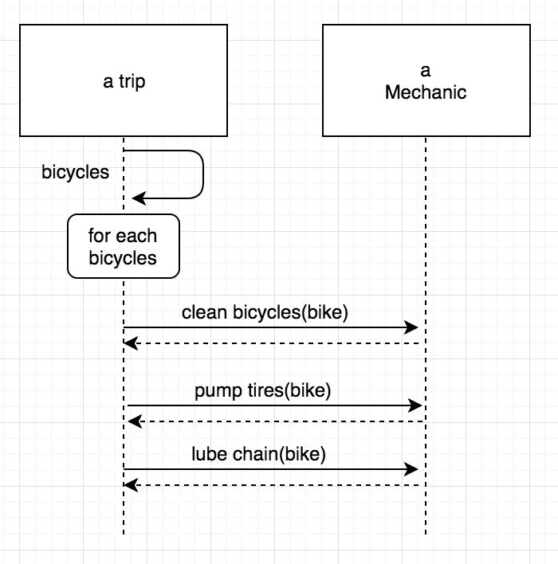
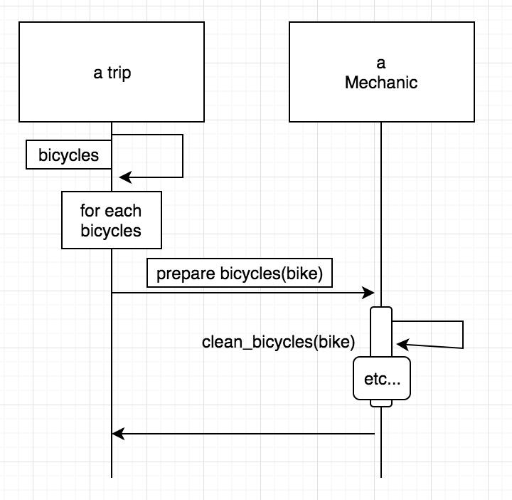
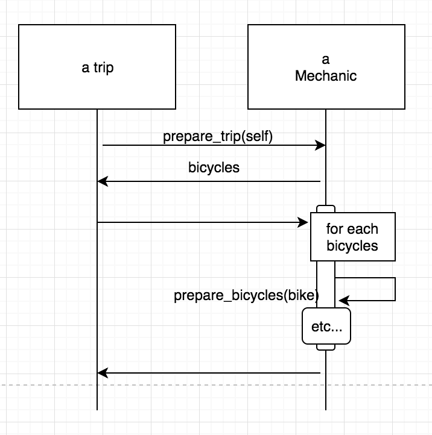

# 4-2

### 4.3.4 어떻게 해야하는지 말해주지 말고 어떤 것을 달라고 요구하기

- 송신자가 원하는 것을 요구하는 메시지
- 수신자가 어떻게 해야하는지 알려주는 메시지

이 두 종류를 구분하는 것이 매우 중요
그래야 잘 정의된 퍼블릭 인터페이스를 가진, 재사용이 가능한 클래스를 만들기 위한 핵심

trips, bicycles, mechanics를 다루는 새로운 예시를 보자.

여행이 시작되려면 모든 자전거가 잘 정비되어 있는지 확인해야함

- Trip은 자전거를 어떻게 준비해야 하는지 알고 있을 수도 있고
- Mehcanic에게 이 작업들을 요청할 수 있음

위 그림은

- Trip의 퍼블릭 인터페이스는 bicycles 메서드를 포함
- Mechanic의 퍼블릭 인터페이스는 clean_bicycle, pump_tires, lube_chain, check_brakes 메서드를 포함
- Trip은 clean_bicycle, ... 메서드를 가지고 있는 객체를 필요로 함

위 설계의 문제점은

- Trip은 Mechanic이 하는 세세한 작업을 다 알고 있음
  - 마치 Trip이 메인 프로그램
  - Mechanic은 호출할 수 있는 함수 덩어리 같음
  - 자전거를 준비하려면
    - Trip을 사용하거나
    - 중복 코드를 만들 수 밖에 없음
  - Trip은 거대한 맥락속에 위치함
  - Trip과 Mechanic은 서로 의존성이 너무 강함

**개선해보자(1)**

위 그림은

- Trip의 퍼블릭 인터페이스는 bicycles 메서드를 포함
- Mechanic의 퍼블릭 인터페이스는 prepare_bicycle 메서드를 포함
- Trip에게는 prepare_bicycle 메서드를 가지고 있는 객체가 필요

전 설계보다 개선된 점은

- Trip은 여러 책임을 Mechanic에게 넘김
  - **어떻게** 와 관련된 책임이 모두 Mechanic에게 넘어감
  - 나중에 Mechanic을 보완하더라도 Trip은 언제나 원하는 결과를 얻음
- Mechanic에 포함된 퍼블릭 인터페이스 양이 줄음
  - 즉, 다른 객체가 의존할 수 있는 메서드 감소
  - Mechanic이 퍼블릭 인터페이스 변경할 가능성 낮춤

하지만 문제는

- Trip은 여전히 Mechanic에 대해 너무 많이 알고 있음
  - 즉, Trip은 불필요한 맥락에 있음
    - 언제나 prepare_bicycle 메서드에 반응하는 객체를 필요로 함

**개선해보자(2)**

### 4.3.5 주어진 맥락에서 독립적일 수 있게 하기

Trip이 다른 객체에 대해 알고 있다는 사실이 맥락(context)을 구성

- Trip은 prepare_bicycle 메시지에 반응할 수 있는 Mechanic 객체를 필요로 함
- 즉, Trip을 사용하려면 특정 맥락을 필요로 함
  - 언제나 자전거를 준비해야하며
  - Mechanic에게 언제나 prepare_bicycle 메세지를 전송해야 함
  - 이 메서드에 반응하는 Mechanic처럼 작동하는 객체 없으면 Trip 사용 불가

가능한 최고의 상황은

- 자신의 맥락으로부터 완전히 독립하기
- 다른 객체가 누구인지, 그들이 뭘 하는지 전혀 모른 채로 협업할 수 있는 객체는 참신하게 재사용 가능
  - 누군지 모르는 객체와 협업하는 방법: 의존성 주입

일단 상황을 다시보자

- Trip이 Mechanic에게 Bicycle 준비하라고 요청하는 건 불가피

이 문제에 대한 해결책은

- **어떤 것** 과 **어떻게** 사이의 구분
- Trip이 원하는 것을 정확히 보자.

  - **자전거를 준비해야 한다 는 것은 Trip이 원하는 어떤 것이 아닌, Trip을 어떻게 준비해야 하는가 이다**

- prepare_trip(self): Trip은 Mechanic에서 자신이 원하는 것(여행을 준비해야함)만 말하고
  - 자기자신을 인자로 넘김
- 이어서 Mechanic은 Trip을 호출하여 Trip이 원하는 bicycles 목록을 얻어옴

위 그림에서

- Trip의 퍼블릭 인터페이스는 bicycles를 포함
- Mechaninc의 퍼블릭 인터페이스는 prepare_trip, prepare_bicycle을 포함
- Trip은 prepare_trip 메서드에 반응할 수 있는 객체가 필요 (preparer)
- Mechanic은 prepare_trip의 인자로 bicycles에 반응할 수 있는 객체가 필요

**어떻게 여행을 준비하는지에 대한 지식은 Mechanics에 고립**, Trip이 속한 맥락은 줄어듬

조금 더 나아가서,

- Trip은 Mechanic같은 객체들을 배열에 담아 놓고 각각에게 prepare_trip 메세지를 전송 가능
  - preparer(여행 준비 담당 객체)가 자신의 역할을 제대로 수행할거라고 믿어야함
- 이런 패턴에 따르면 preparer를 추가해도 전혀 코드 수정할 필요 없음
  - 즉, Trip을 변경하지 않고 확장 가능

1. 나는 내가 원하는 것을 알고 있고, 네가 어떻게 해야하는지도 알고 있음
2. 나는 내가 원하는 것을 알고 있고, 네가 원하는 것도 알고 있음
3. 나는 내가 원하는 것을 알고 있고, 네가 주어진 역할을 잘 할거라고 알고 있음

## 여기까지 요약해보자면

시퀀스 다이어그램을 이용하여 디자인을 고민한 결과

- 퍼블릭 인터페이스를 정의하고
- 새로운 객체를 찾음

즉, 우리의 관심을 객체 => 메시지 로 옮기면서
퍼블릭 이넡페이스를 기반으로 애플리케이션을 디자인할 수 있음

## Summary(4-2 요약)

메시지의 핵심은
**어떻게 해야하는지 말하지말고**
**어떤 것을 달라고 요구하기**

- 송신자가 원하는 것을 요구하는 메시지
- 수신자가 어떻게 해야하는지 알려주는 메시지

> like. 손님: XX메뉴(라면) 주문할께요 (correct) / XX메뉴(라면)에 물을 먼저 냄비에 넣고, 끓을 때 스프를 넣고.. (wrong)

---

위 예제의 개선 과정.
일단 만들려는 거는 trips, bicycles, mechanics 객체를 통해
여행을 시작하기 위해 모든 자전거가 잘 정비되어 있는지 확인하는것

1번의 문제점

- Trip이 Mechanic의 세세한 작업 다 알고 있음
  - Trip은 거대한 맥락속에 위치하고 의존성이 너무 강함

2번의 개선점 및 문제점
개선

- Trip은 여러 책임을 Mechanic에게 넘김 (격리시킴)
  - Mechanic을 보완하더라도 Trip은 언제나 원하는 결과 얻을 수 있음
- Mechanic의 퍼블릭 인터페이스 양이 줄음
  - 다른 객체가 의존할 수 있는 메서드가 감소
  - 퍼블릭 인터페이스 변경 가능성 낮아짐

문제점

- Trip은 여전히 Mechanic에 대해 너무 많이 알고 있음
  - 즉, Trip은 여전히 불필요한 맥락에 있음
  - 언제나 prepare_bicycle메서드에 반응하는 객체를 필요로 함

3번의 개선점
1,2번의 핵심 문제는 **Trip이 다른 객체에 알고 있다는 사실이 맥락(context)을 구성**

개선할 수 있는 방법

- 맥락으로부터 완전히 독립하기
- 다른 객체가 누구인지, 그들이 뭘 하는지 전혀 모른 채로 협업하도록 변경
  - 이 방법 중 하나는 **의존성 주입하기**
