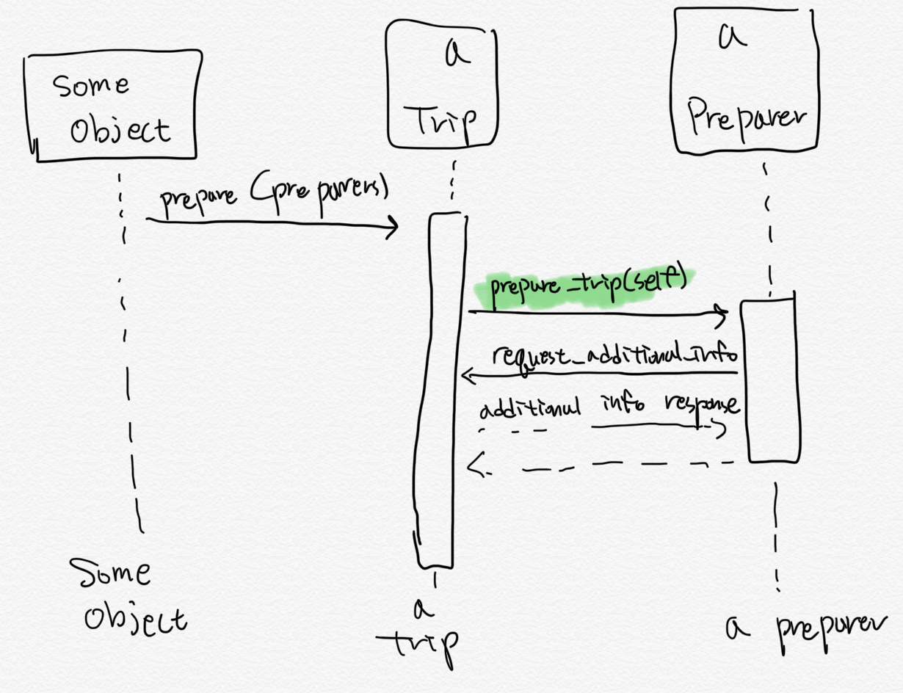

# 5. 오리타입으로 비용 줄이기

OOD 의 목표는 코드 수정 비용 줄이기
어플리케이션 디자인의 핵심은 메시지
그래서 엄격하게 정의된 `public interface`를 구축하는 과정이 중요

이 기술의 이름은 **오리타입** (`duck typing`)

- 특정 클래스에 종속되지 않는 퍼블릭 인터페이스
- 클래스에 대한 값비싼 의존을 메시지에 대한 부드러운 의존으로 대체 (사실 뭔소린지 와닿지 않음)
- 객체의 클래스보다는 행동에 의해 규정되는 카멜레온
  - 객체가 오리처럼 꽥꽥대고 걷는다면 이 객체는 오리다 와 같은 말

## 5.1 오리 타입 이해하기

> 타입: 프밍 언어들은 타입이라는 개념을 통해 변수의 내용물이 어떤 카테고리에 속하는지 설명하려함
> string: 문자열, number: 숫자, array: 배열 등

타입을 통해 내용물이 어케 행동하는지 예측 가능

- 숫자는 더하기 빼기, 문자열은 이어 붙이기, 배열은 인덱스 갖고 있음 등

타입을 예측할 수 있는 이유는 객체들의 `퍼블릭 인터페이스`를 믿기 때문
한 객체가 다른 객체의 타입을 알고 있다면 대상 객체가 반응할 수 있는 메시지를 알고 있는 것

객체는 서로 다른 여러 개의 인터페이스 구현 가능

- 객체의 타입은 객체를 사용하는 사람의 쓰임에 따라 달라짐
- 객체를 사용할 때, 객체의 클래스가 뭔지 신경 쓸 필요 없음
- 클래스는 객체가 퍼블릭 인터페이스를 갖추기 위한 하나의 수단
- 객체가 클래스를 통해 얻게 된 퍼블릭 인터페이스는 이 객체가 가진 여러 개의 퍼블릭 인터페이스 중 하나에 불과
- 객체 사용시 모든 객체가 자신이 구현한 어떤 인터페이스 또는 모든 인터페이스에 맞춰 행동한다고 믿어도 됨
- 진짜 중요한 것은 객체가 무엇인가가 아닌 **어떻게 행동하는가** 임

**모든 객체가 어떤 타입이든 될 수 있다고 믿으면** 디자인의 무한 가능성 열림

이런 유연성을 사용하기 위해 `클래스를 가로지르는 타입(across-class types)`을 알아 볼 수 있어야함

- 다시 말해 오리 타입은 명시적이고 잘 정리된 계약서와 같은 public interface 를 가져야 함

### 5.1.1 오리 타입 무시하기

오리 타입을 이해하기 위해, 오리타입을 사용하지 않았을 때 부터 알아보자

Trip 의 prepare 메서드는 인자로 받은 mechanic 객체에게 prepare_bicycles 메시지를 전송

- Mechanic 클래스를 참조하는 객체가 없다는 것을 주목하자.

```typescript
class Trip {
  readonly bicycles: array;
  readonly customers: any;
  readonly vehicle: any;
  // 무엇이든 'mechanic' 인자의 클래스가 될 수 있음
  prepare(mechanic) {
    return mechanic.prepare_bicycles(bicycles);
  }
}

// 우연히 아래 클래스의 인스턴스를 넘겨주면 제대로 작동함
class Mechanic {
  prepare_bicycles(bicycles) {
    return bicycles.forEach(b => prepare_bicycle(b));
  }
  prepare_bicycle(bicycle) {
    // ...
  }
}
```


- prepare 메서드 자체는 Mechanic 클래스에 의존하지 않음
- 하지만 prepare-bicycles 라는 메서드에 반응할 수 있는 객체를 수신해야한다는 사실에 의존하고 있음
  - **trip 의 prepare 메서드는 여행준비를 담당하는 객체(preparer)를 인자로 받았다고 확신함**

### 5.2.1 문제가 더 복잡해지면

위 코드에서 `여행을 어케 준비할지`에 대한 지식을 Mechanic 에게 넘김

요구사항이 변경되어
ㅈ2
- 여행 준비에 Mechanic 뿐만 아니라 trip coordinator, driver 가 필요해졌다고 하자
- 각 이름에 맞춰 클래스 만들고 Trip 의 prepare 메서드가 인자로 넘어온 객체 각각에게 알맞은 행동을 호출하도록 수정하자

```typescript
class Trip {
  readonly bicycles: array;
  readonly customers: any;
  readonly vehicle: any;
  // 여행 준비과정 복잡
  prepare(preparers) {
    preparers.forEach(function(p) {
      switch (p.constructor.name) {
        case "Mechanic":
          preparer.prepare_bicycles(bicycles);
        case "TripCoordinator":
          preparer.buy_food(customers);
        case "Driver":
          preparer.gas_up(vehicle);
          preparer.fill_water_tank(vehicle);
        default:
      }
    });
  }
}

class TripCoordinator {
  buy_food(customers) {
    //...
  }
}

class Driver {
  gas_up(vehicle) {
    // ...
  }

  fill_water_tank(vehicle) {
    // ...
  }
}
```

변경된거

- 클래스 2 개 추가
- Trip 의 prepare 메서드가 3 개의 서로 다른 클래스 참조하고 메서드의 이름도 정확히 알고 있음
  - 코드의 다른 곳 변경시 Trip 의 prepare 메서드 역시 변경해야 함
- 위 디자인은 클래스 종속적
  - 우리가 전송하고 있는 메시지를 이해하지 못하는 클래스를 다뤄야함
  - 이 상황에 봉착하면 새로운 객체가 이해할 수 있는 메시지를 찾아야함
  - 예컨대, Coordinator 와 Driver 인스턴스를 받으면
  - 이 클래스의 public interface 를 보고 buy_food, gas_up, fill_water_tank 와 같은 메서드가 prepare 가 필요로 하는 행동임을 알 수 있음

이 행동을 실행하는 가장 명확한 건 걍 `메시지 전송하기`
하지만 문제는

- 인자들은 모두 다른 클래스의 인스턴스
- 그 인스턴스는 다른 메서드를 구현
- switch-case 문으로 객체들에게 올바른 메시지 전송 가능
- 하지만 **의존성 분출**

위 prepare 메서드는

- 클래스의 명시적인 이름
- 각 클래스가 이해하는 메시지의 이름(메서드 이름)
- 이 메시지에 전송해야하는 인자
  가 무엇인지 알고 있음

의존성 너무 높아짐

또한 이렇게 코딩하면

- case 문 계속 재생산
- 이 메서드는 수많은 클래스 이름을 알게됨
- 유연하지 못한 프밍

### 5.1.3 오리 타입 찾기

위 의존성을 제거하기 위해 다음을 이해하자

- Trip 의 prepare 메서드는 1 개의 목적을 가짐
- prepare 인자 역시 이 목표를 이루기 위해 협업하는 객체

`인자의 클래스가 무엇을 할 줄 아는지` 말고 `prepare가 무엇을 원하는지`에 집중
prepare 는 여행을 준비하고 싶어함

- 인자가 주어진 작업을 제대로 할 줄 안다고 prepare 가 믿기만 하면 디자인 간단
- prepare 메서드는 인자의 클래스에게 아무것도 기대 안함
- 이 인자가 `여행을 준비하는 객체(preparer)`이기만 하면됨


결론은 prepare 메서드는 Preparer 에게 어떤 메시지를 전송할지만 생각하면 됨: `prepare_trip`

---



Preparer 란 무엇일까?

- 현재 시점에서 추상적인 존재
- prepare_trip 을 구현하고 있는 객체가 곧 Preparer
- 이 추상화를 이해하면 Mechanic, TripCoordinator, Driver 는 모두 preparer 처럼 행동해야하고 prepare_trip 을 구현해야함
