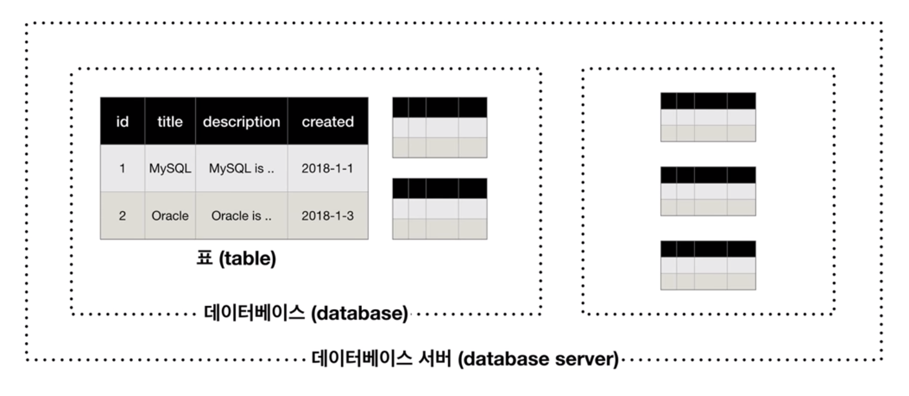
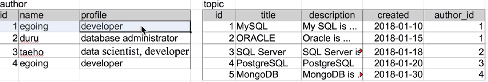
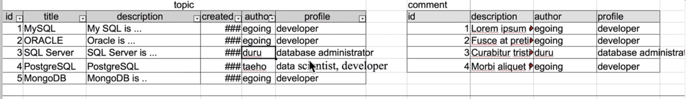
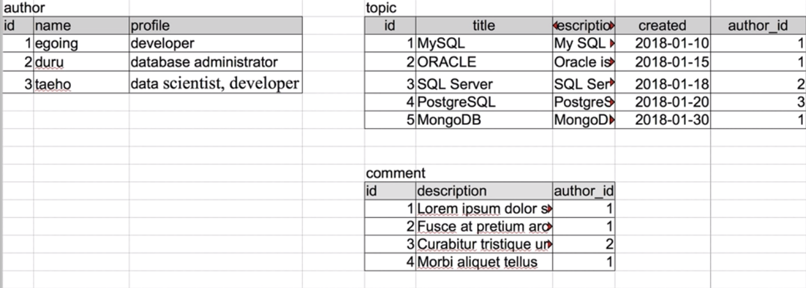

# database

# fundamental

## 1. mysql 구조



- 표들을 그루핑한 것을 database
- schema라는 표현도 씀
  - 표들을 서로 연관된 데이터들을 그루핑할 떄 사용하는 일종의 폴더
  - 스키마들이 많아지면 데이터베이스 서버라는 곳에 저장됨.

## 2. mysql 서버 접속

```sql
    mysql -uroot -p
    mysql -u${account}
```

- root로 데이터 직접다루는거 위험
  - 유저 하나 파서 사용하는게 권장

## 3. mysql schema의 사용

```sql
    use ${database_name}
    show databases;
```

## 4. Structured Query Language

관계형 데이터베이스에서 공통으로 쓰임

## 5. table 생성

[excel data](https://www.notion.so/7f21eb647ee447449b2da2d9fdc92a05)

위 테이블을 테이블로 만들어보자.

```sql
    create table topic(
    	id INT(11) NOT NULL,
    	title VARCHAR(100) NOT NULL,
    	description TEXT NULL, // 설명이니까 varchar (255제한)가 아닌 TEXT(65000제한)
    	created DATETIME NOT NULL,
    	author VARCHAR(30) NULL,
    	profile VARCHAR(100) NULL,
    	PRIMARY KEY(id)
    )
```

- INT(m) NOT NULL AUTO_INCREMENT
  - m : 숫자를 몇자리까지 노출할건지, 보통 11많이 씀
  - null 값 허용 안함
  - AUTO_INCREMENT : 1씩 자동 증가
- VARCHAR(size)
  - VAR는 variable, CHAR는 character(문자)
  - size까지만 받고 그 이상은 자름
- DATETIME
- primary key
  - 성능
  - 중복방지

## 6. SQL INSERT

```sql
    insert into topic (title, description, created)
    			VALUES ('MYSQL', 'MYSQL is...', NOW())
```

- insert into \${TABLE_NAME} (COLUMNS, ...) VALUES (값, 값..)
  - VALUES( NOW() ) 현재 시간 들어감

## 7. SQL SELECT

```sql
    select id, title, created, author from topic where author='egoing'
```

- condition
  - where
    - ${column}=${value}
    - like
  - order by \${column} desc
  - LIMIT \${number}

## 8. SQL update

```sql
    update topic set description='oracle is ...' where id=2
```

- update ${table_name} set ${column}=\${value}

---

# 깊게

## 1. RDB의 필요성

- 중복된 데이터의 문제점
  - 중복된 데이터(row)가 천만번 등장한다면?
  1. author의 egoing이 천만번 등장할 경우, 수정해야할 때 천만번 수정해야됨.
  2. 또 egoing 동명이인 여러명일 수도 있어서 구분하기 어려움

[Copy of excel data](https://www.notion.so/f89b0e02cf6c459792b3cad1d7c357c7)

**RDB로 해결하기**

- author에 문제가 되는 데이터들이 있으니까 얘를 테이블로 따로 뺄거임



- 문제 해결하기
  - 1번 : author 테이블의 1번 아이디 egoing만 수정하면됨
  - 2번 : primary key인 id값으로 동명이인 구분가능
- 근데 문제 하나 생김
  - 테이블이 별도로 나뉘면서 결과값을 합쳐서 볼 수 없음
  - 근데 요건 join 문으로 해결 가능.

MYSQL(RDB)를 통해 저장은 분산으로, 표현은 합쳐서

```sql
    SELECT * from topic left join author on topic.author_id = author.id;
```

## 2. JOIN

```sql
    select * from topic left join author on topic.author_id = author.id;

    // id가 모호하다고 에러 발생
    select id, title, description, created, name, profile from topic left join author on topic.author_id = author.id;

    select topic.id, title, description, created, name, profile from topic left join author on topic.author_id = author.id;
    select topic.id as topic_id, title, description, created, name, profile from topic left join author on topic.author_id = author.id;

```

---



- topic 테이블의 database administrator를 바꿀 경우, **2개 테이블의 profile 수정해야함**



- 근데 위와 같이 author_id로 관계를 가질 경우,
- author 테이블의 profile만 수정하면 됨

즉, table을 분리하면 topic과 author만이 관계를 맺는 것이 아닌 모든 테이블(comment, ..) 등 author의 식별자인 id와 일치하는 값을 가진다면 JOIN을 통해서 관계를 맺을 수 있음.

## Summary

RDB의 필요성

- 중복된 데이터가 많이 등장할 경우 유지보수 어려움
  - 어떤 한 column의 row값이 천만번 등장할 경우, 그 값을 수정해야 한다면 천만번 서정해야함
  - 또한 name이라는 컬럼의 hoil이라는 이름이 동명이인이 여러명일 경우 구분 어려움

RDB로 해결하기

- 문제가 되는 컬럼명을 테이블로 따로 생성

**RDB의 필수 JOIN**

- 저장은 분리하고, 표현은 JOIN으로 합쳐서
