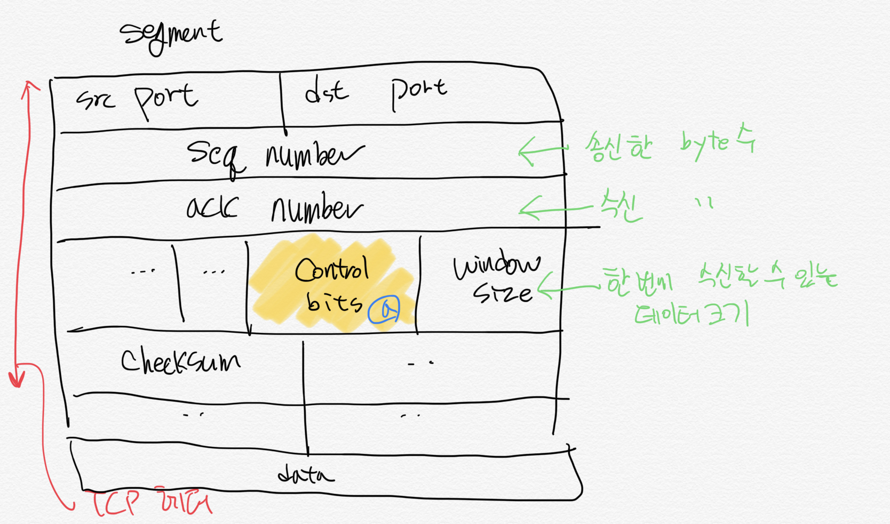
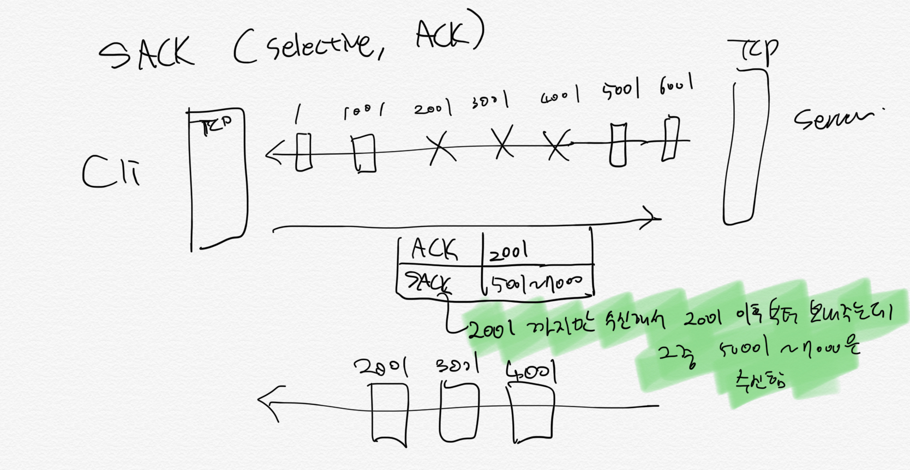

# transport

- 역할: __포트번호__ 를 통해 애플리케이션 계층으로 데이터 전달

## TCP가 정확하게 데이터 전달하는 방법ㅍ

- 웹, 이메일, FTP와 같은 정확한 데이터 전달에 이용

### TCP가 하는일

- 데이터 전송에 `신뢰성`을 더하기 위해
    - 데이터를 세그먼트 단위로 분할
    - 전송 속도 조절
    - 데이터 전송 안되면 재전송
        - 전송여부 확인은 송수신측이 주고 받은 byte수 비교

TCP 헤더의 구조. TCP 세그먼트는 데이터 본체에 TCP 헤더가 붙은 형태로 구성

- (a): control bits
    - 현재 통신 상태를 표현하는 flag
    - TCP 통신 상태를 제어하기 위함
    - CWR : 혼잡하니까 전송량 내려줘
    - ECE : 혼잡해서 수신못할 수도 있어
    - ACK : 이전 동작 확인했어. Ack number와 조합하여 사용

## 통신 개시 ~ 종료까지

TCP 통신은 커넥션 연결에서 시작한다.

- 첫번째 그림: 커넥션 연결은 __3-way handshake__ 라 부름
- 두번째 그림: 커넥션 맺을 때, 송 수신측은 원활한 통신을 위해 사전에 일련번호와 최대 세그먼트 크기(MSS)를 서로 합의하고 조율

## 데이터 전송 과정에서 일련 번호 바뀌는 과정

- SEQ number
    - 커넥션 맺는 과정에서 1 증가
    - data 전송시, 전송한 만큼 증가
- ACK number 
    - 수신한 데이터만큼 증가

위 두가지 번호를 비교하여 송수신측이 각각 몇 byte 주고 받은지 확인 가능
* __송수신한 바이트 수를 seq나 ack number로 계산하려면 1byte 빼고 해야함__
    - 왜냐하면 1byte는 커넥트(3-way-handshake)시 1 증가한거니까중

## 송신 실패 여부

송신측에서 __일정 시간 지난 후, 수신측에서 응답이 오지 않을 경우__ 송신 실패로 간주
- __최근에 정상 응답 받은 후 부터 데이터 재전송__

## Window Size: 연속된 데이터를 몰아 보내서 전송속도 높이기

- 근데 연속해서 받는 데이터 많으면 수신측이 제때 처리 못함

### Flow Control: 한번에 받을 수 있는 데이터 크기 통보

- 수신측은 수신 데이터 임시 보관할 수 있는 __Buffer__ 라는 저장공간 가짐
- 수신측은 버퍼에 쌓아두고, 버퍼에서 데이터를 꺼내서 처리함
- 만약 수신 측 성능이 낮아서 데이터가 들어오는 속도보다 처리 속도가 느리면 문제 발생

_해결책 1: Sliding Window_
- 데이터 흐름을 동적으로 조절
    - 수신측에서 설정한 윈도우 크기만큼 송신측에서 확인응답 없이 세그먼트를 전송
- __TCP 헤더의 window 사이즈에 버퍼 크기 설정하여 송신측에 통보__
- 이 크기를 수시로 송신측에 알려줌

_해결책 2: stop and wait_
- 매번 전송한 패킷에 대해 확인응답을 받아야만 그 다음 패킷을 전송하는 방법

### 버퍼가 가득찬 경우

버퍼 가득차면 윈도우사이즈 0으로 설정, __데이터 전송 멈춤__
- 전송 재개 시점을 알기 위해 송신측은 __탐색 패킷__ or __window prove__라는 패킷을 수신측에 보냄
    - 수신측은 현재 버퍼 크기를 보냄
- 수신측은 응답을 받아 현재 윈도우 사이즈를 확인한 후 전송 재개 여부 결정

### Congestion Control: 버퍼가 비어있더라도 네트워크가 혼잡하면

## Slow Start

- 합증가/곱감소 방식 이용
- 패킷을 1개씩 보냄
- 문제없이 패킷 도착시 응답으로 ACK에 window size 1씩 증가
- 늘리다가 혼잡현상 발생시 1 감소

[flow control, congestion control 정의 해결책](http://jwprogramming.tistory.com/36) 여기 정리 잘됨

- 인터넷 계층 헤더 안에 혼잡 플래그가 ON으로 설정되면
    - ECE, CWR 플래그를 사용                                                                                              

> 이외에, 중간에 누락된 패킷만 재전송하기

## UDP

전송의 신뢰성보다 속도가 중요한 동영상 스트리밍

- __3-way-handshake같은 접속 여부 확인 안하고 바로 송신__
- __패킷이 도중에 손실되더라도 걍 보냄__
- __버퍼에서 데이터가 넘쳐도 걍 놔둠__

### broadcast, multicast

1개 패킷을 여러 수신지에 보냄

> __브로드 캐스트는 파일 공유나 DHCP와 같이 네트워크 내의 여러 컴퓨터나 통신장비와 정보 교환시 사용__

## UDP를 app 계층으로 둘러싸기

UDP의 신뢰성 문제는 application 계층에서 __flow control__ , __congestion control__를 구현하여 부족한 신뢰성 보완

## 문제

- 3-way-handshake 과정 써보기