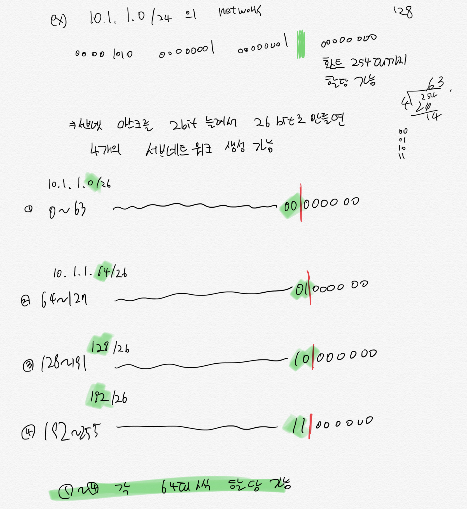

# 4. 라우팅, 인터넷 계층

## IP 어드레스

- IP 고갈을 방지하기 위해 private / public address 구분 기법 이용

Private IP

- 사설 IP
- 사무실, 가정 내에서 사용
- network 내부에서 사용, 외부에서 해당 IP 로 접근 불가

Public IP

- 공개 IP
- 인터넷에서 사용 가능
- 외부 접근 가능, server 에서 주로 사용

## IP v4

- 32bit
- 8bit 씩 4 단위로 끊어서 10 진수로 표현

X.X.X.X

- X 는 0~255 개 숫자

### IP v4 header

- 송신지와 수신지의 IP 어드레스 외에 패킷 길이와 같은 다양한 정보 포함
  - TTL(time to live): 패킷 생존기간

### TTL: IP 패킷의 유통기한

수신지로 지정된 컴퓨터가 실제 존재하지 않거나 통신 경로 못찾아서 패킷이 네트워크 안을 떠돌게된다. 이 때 네트워크 혼잡이 발생할 수 있는데 이를 방지하기 위해 IPv4 헤더에는 TTL 정보 설정

- 라우터를 거칠 때마다 1 씩 감소
- TTL 0 이 된 순간 패킷 소멸

### 좁은 길을 지날 때 분할해서 가기

MTU(maximum transmission unit): 한 번에 전송될 수 있는 데이터 크기

- 경로 상태가 나쁘면 라우터는 MTU 값에 따라 패킷 분할
- 단점: 라우터의 작업 부하 높아지거나 분할된 패킷 중 일부 유실되면 유실되면 복원 어려움
- **그래서 송신 전에 라우터의 통신 경로 전체의 MTU 를 살펴본 후 처음부터 MTU 보다 작은 크기의 패킷을 만들도록 설정**

## IPv6

32bit address 고갈될 위키

어드레스 길이는 128 비트. 2^128 개의 장비 식별 가능.

- 16bit \* 8 = 128bit

## IP 어드레스 활용

- 주소 할당 방법에 따라 **네트워크부** / **호스트부** 로 나뉜다.

라우터는 송신지 IP 어드레스의 네트워크 부의 정보를 보고

- 송신할 목적지가 같은 네트워크 안인지
- 다른 네트워크인지 판단

> 어디까지가 네트워크 부?
> IP 어드레스의 네트워크 부가 같은 컴퓨터들의 그룹: 네트워크
> 그래서 네트워크 부가 다르다는 말은 그 네트워크는 서로 다른 네트워크임
> 이는 라우터와 같은 장비를 통하지 않고서는 서로 연결될 수 없음

## 어드레스 클래스

하나의 IP 어드레스 안에서 **네트워크 / 호스트 부를 미리 고정**

제약

클래스 A 같은 경우는 1 개 네트워크당 1677 만대 호스트 어드레스 할당 가능하지만, 1 개 네트워크에 그렇게 많은 장비 할당될 일 없음 -> 낭비

이와 같은 네트워크를 좀 더 세분화 할 수 있는 것이 **서브넷 마스크**

## 서브넷 마스크

- 어드레스 클래스는 네트워크 부 길이가 고정
- 서브넷 마스크 사용시 이 길이를 비트 단위로 유연하게 늘려 쓰는게 가능.

### IP 어드레스 할당 방법

- IP 어드레스는 **네트워크 상에서 호스트를 식별하기 위해 사용**
- 전체 32bit 중 네트워크부를 제외한 host 부만 자유롭게 사용

서브넷 마스크 표현 방법

```
10.1.1.1/24 // 24bit가 네트워크 부

서브넷 마스크 표현
// 11111111 11111111 11111111 00000000
// 255.255.255.0 (10진수 표현)

위 IP의 네트워크 부는

10.1.1.0/24의 네트워크는
10.1.1.1 ~ 10.1.1.254 까지
```

- 네트워크 구분시 가장 첫번째 IP 는 `network address`
- 가장 마지막 IP 주소는 `broadcast address`
- 따라서, 네트워크 IP 범위에서 가장 첫번째 주소와 마지막 주소 2 개는 호스트에 할당 불가
- 이는 기본 서브넷 마스크를 사용하여 서브넷팅 시키지 않은 모든 네트워크에 동일 적용


### 서브넷 마스크로 네트워크 세분화 하기

10.1.1.0/24 의 네트워크는

호스트 254 대까지 할당 가능

서브넷 마스크를 2bit 늘려서 26bit 로 만들면

`10.1.1.0/26`



### 서브넷 마스크의 한계

어드레스 클래스에서 이미 정해진 network 부 길이를 더 늘릴 수 있음

- 근데, 호스트길이가 이미 짧은 C 클래스는 남은 8bit 에서 서브넷 부와 호스트를 나누니까 실제 할당되는 호스트 수 급감
- 그래서 서브넷 도입시 호스트가 긴 class A,B 에 사용

## Private addr

- 인터넷 연결시 외부에서 접근 불가
- NAT(network address translation)을 통해 public IP 로 변환.

> 예약된 IP adress
> 127.0.0.1 은 loop back address, localhost 라 부름. 얘는 호스트 자신
> 호스트 부의 bit 을 모두 1 로 설정한 addr 은 해당 네트워크의 모든 호스트를 의미하는 broadcast addr
> 호스트 부의 비트가 모두 0 으로 된 경우 네트워크 전체
