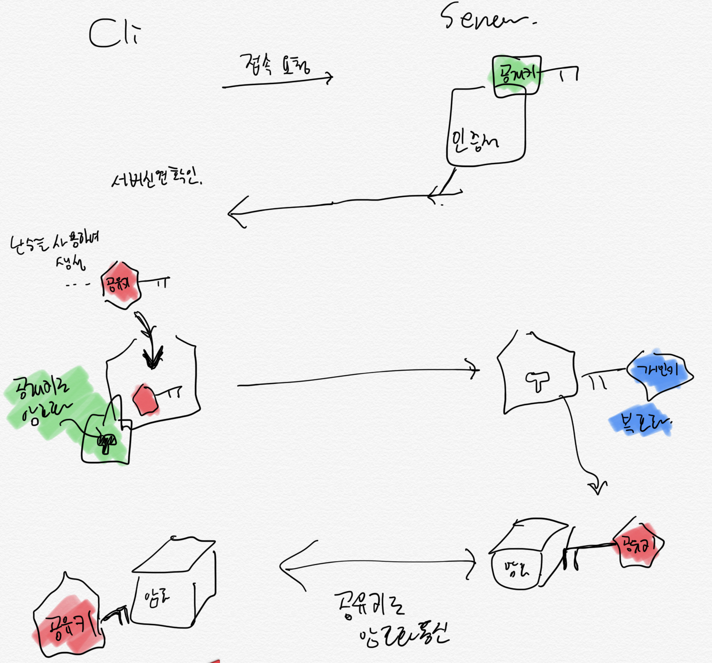

# 6. 보안

## 암호화로 데이터를 보호

- 암호화된 데이터는 제3자에게 유출시 내용식별 불가
- 암호화의 열쇠 역할을 하는 Key

1. 공유키 암호화
2. 공개키 암호화

### 공유키 암호화

1개의 키를 사용하여 암호화, 복호화

- 키를 안전하게 공유하기 어려움
- key 유출시 암호화된 데이터를 누구나 복호화 가능
- 데이터 공유받을 모든 사람에게 동일 키를 나눠줘야 해서 관리 어려움

### 공개키 암호화

2가지 키를 사용, 1개는 자신이, 나머지 1개는 다른 사람이 가짐
1. 암호화용: 공개키
2. 복호화용: 개인키

- 먼저 상대에게 공개키 전달
- 상대는 데이터를 공개키를 이용하여 암호화
- 이 데이터는 개인키로만 복호화 가능

### SSL/TLS

서버 인증서를 사용하여 통신을 암호화

- 서버 인증서를 활용하여 서버를 증명
- 통신 구간 암호화
- 데이터 위변조 막음

__https가 대표적으로 ssl/tls를 사용하는 보안 프로토콜__

