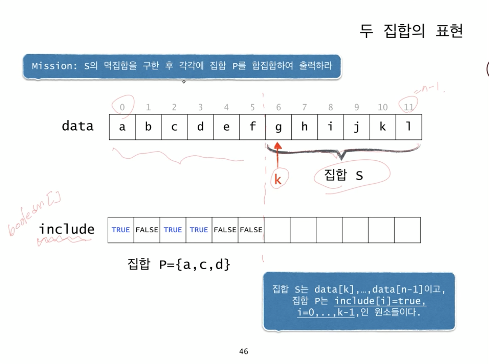
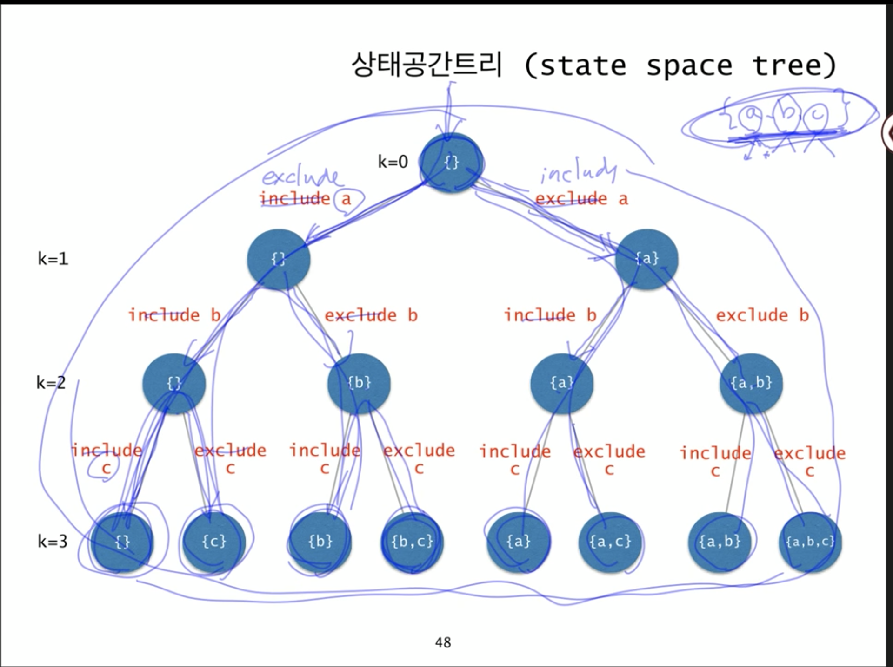

# powerset(멱집합)

어떤 집합의 모든 부분집합

data = {a,b,c,d}

공집합
a,b,c,d
ab, ac, ad, bc,
...

총 2^4 = 16개
왜냐면
a 선택 / 미선택 : 2
b 선택 / 미선택 : 2
...

총 2^n개가 됨

## 멱집합 출력하기

a. {a,b,c,d,e,f}의 모든 부분집합을 나열하려면

1. a를 포함한 **{b,c,d,e,f}의 모든 부분집합** 나열
2. a를 제외한 **{b,c,d,e,f}의 모든 부분집합** 나열

a-1. {b,c,d,e,f}의 모든 부분집합에 {a}를 추가한 집합 나열

1. {c,d,e,f}의 모든 부분집합에 {a}를 추가한 집합들을 나열
2. {c,d,e,f}의 모든 부분 집합에 {a,b}를 추가한 집합들을 나열

...

```
// psuedo code
powerSet(s)
  if S is an empty set
    print nothing
  else
    let t be the first element of S;
    find all subsets of S-{t} by calling powerSet(S - {t})
    print the subsets;
    print the subsets with adding t;
```

Mission: S의 멱집합을 출력하라
근데 이렇게 하려면 powerSet 함수는 여러 개의 집합들을 return해야 한다. 어케?

하면 할 수 있는데,
전부다 메모리에 저장할 필요 X,
출력하는게 목적이므로 print하고 잊어버리면 됨.

여튼 개선해야됨.

powerset이라는 함수가 단순히 멱집합을 구해서 반환하는 것이 아닌, 출력하고 마는 것으로 수정해보자.

## 2. improvement

```
// psuedo code

powerSet(P, S)
  if S is an empty set
    print P;
  else
    let t be the first element of S;
    powerSet(P, S-{t})
    powerSet(P U {t}, S - {t})
```

powerSet의 Mission
S의 멱집합을 구한 후, 즉 모든 부분집합을 구한 후(S) 각각에 집합 P를 합집합하여 출력.

recursion 함수가 **2개의 집합** 을 매개변수로 받도록 설계해야함.
두 번째 집합의 모든 부분집합들에 첫번째 집합을 합집합하여 출력.

> a-1. {b,c,d,e,f}의 모든 부분집합에 {a}를 추가한 집합 나열
>
> 1.  {c,d,e,f}의 모든 부분집합에 {a}를 추가한 집합들을 나열
> 2.  `{c,d,e,f}`의 모든 부분 집합에 `{a,b}를 추가한 집합들`을 나열
>     `{c,d,e,f}`는 집합 S : k번째부터 마지막 원소까지 연속된 원소들
>     집합 P : 처음부터 k-1번째 원소들 중 일부



집합 S는 data[k], ... , data[n-1] 이고,
집합 P는 include[i]=true, i=0, .., k-1인 원소들

우리는 위 그림과 같은 방식으로 다음 방법을 적용

- `이 트리를 체계적으로 탐색할 경우 해를 발견 가능`
- 그래서 트리를 다 탐색할 경우 1개의 부분집합 완성
- **왜냐면 선택/미선택에 관해 모든 노드를 순환 탐색하며 결정했기 때문**

---

---

코드를 보자

```java
char data[] = {'a', 'b', 'c', 'd', 'e', 'f'};
int n = data.length;
boolean [] include = new boolean[n];

void powerSet(int k) {
  if (k == n) {
    for (int i = 0; i<n; i += 1) {
      if (include[i]) cout<<data[i];
      return;
    }
  }
  include[k] = false;
  powerSet(k+1);

  include[k] = true;
  powerSet(k+1);
}
```

Mission: data[k], ..., data[n-1]의 멱집합을 구한 후 각각 include[i]=true, i=0, ..., k-1인 원소를 추가하여 출력

처음 이 함수 호출시 `powerSet(0)`로 호출. 즉 P는 공집합이고 S는 전체집합.

**basecase**
집합 S가 공집합인 경우

- include, powerSet의 인자 k : 트리상에서의 현재 위치 표현
  - k는 상태공간트리에서 몇번째 레벨에 있느냐를 나타냄
- k==n 위치가 리프노드라면 basecase

- `include[k]=false; powerSet(k+1)` : 상태공간트리에서 왼쪽 ㄱ
- `include[k]=true; powerSet(k+1)` : 상태공간트리에서 오른쪽 ㄱ

## 상태 공간 트리



어떤 문제를 푸는 과정을 추상화.. 그 문제에 대한 상태 공간 트리를 구상한 후에
내가 찾고자 하는 해를 반드시 포함하고 있는 트리니까
결국 해를 찾는 다는거는 모든 노드를 방문해서 반드시 해를 찾는 것

- 해를 찾기 위해 탐색할 필요가 있는 모든 후보들을 포함하는 트리
- 트리의 모든 노드들을 방문하면 해를 찾을 수 있음
- 루트에서 출발하여 체계적으로 모든 노드를 방문하는 절차를 기술

**모든 멱집합을 구하는 과정을 상태 공간 트리의 모든 노드를 방문하는 일을 한다. 라고 생각하는 것**

이번 챕터는 상태공간트리를 이해하는 것을 목표로 함.
상태공간트리라는 것이 위 문제와 같은 문제를 이해하는데 강력한 도구.

## Summary

상태공간트리를 적절하게 이용한 예라고 볼 수 있음

상태공간트리는 찾는 해를 포함하는 트리.
즉, 부분집합이라는 해를 포함하는 트리
부분집합이라는 해가 존재하고, 상태 트리의 한 노드에 해당
따라서 이 트리를 체계적으로(특정 단위로 recursive) 탐색할 경우 해를 발견 가능

n-queens는

- 해답을 찾기 위해 모든 상태 트리 방문.
- 방문 하면서 백트래킹 기법을 이용하여 해가 아닌 경우 앞에 내린 결정을 번복

멱집합은

- 해답을 찾기 위해 모든 상태 트리 방문.
- 방문하면서 모든 노드에 대해 결정을 내렸을 경우 (얘는 해가 아닌 경우가 없음, 백트래킹 불필요)
  - 그게 해답임
