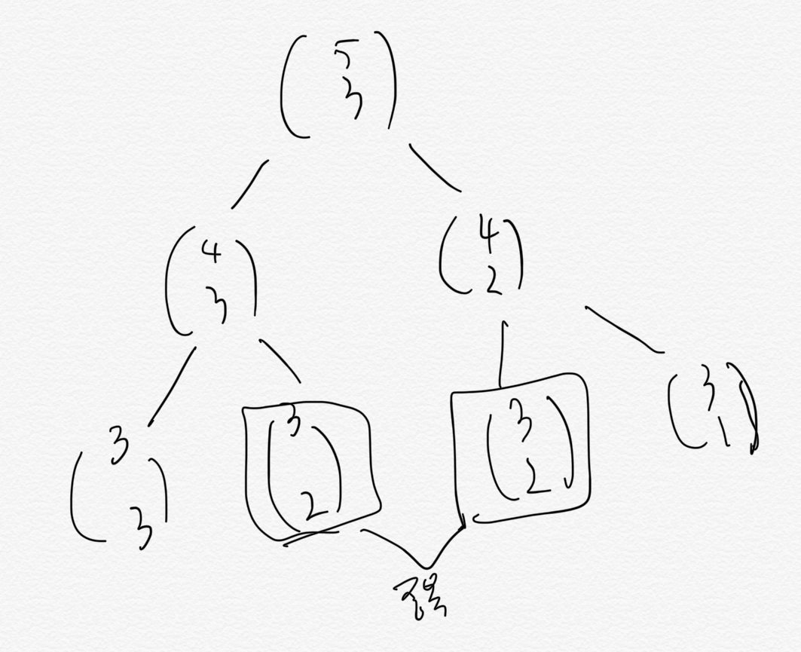

# 1. DP

## fibonacci

```
int fib(int n) {
  if (n==1 | n==2) {
    return 1;
  }
  return fib(n-2) + fib(n-1);
}
```


많은 계산이 중복됨.

1. top-down
   중간 계산 결과를 caching 하여 중복 계산 피함.

2. bottom-up
   f[1], f[2], ...f[n] 까지 순서대로 계산하여 중복 피함.

- 예컨대 f[8]을 계산하기 위해 f[6]+f[7] 임
- f[6]을 계산하기 위해 f[5]+f[4], ...
- 기본적인 값부터 계산하여 원하는 계산까지 도달

## 이항 계수

이항 계수를 구해보자.
n개에서 r개를 선택(순서없음, 부분집합 같은거)하는 경우의 수는 `nCr`로 구할 수 있음.

100개 에서 98개를 선택 = `100! / 2! x 98!` 인데 100!은 계산하기엔 굉장히 큰 수.

---

일단 리커젼으로 구해보자.

```C
int bionomial(int n, int k) {
  if (n == k || k == 0) {
    return 1;
  }
  return binomial(n-1, k) + binomial(n - 1, k - 1)
}
```

- base-case: 

근데 단순히 순환하기엔 역시 **중복** 발생



bottom-up

순환식의 오른쪽에 등장하는 값이 왼쪽에 할당되는 값보다 먼저 계산되어야함. 이렇게 이해하자.

```C
int getCombinationTopDown(int n, int r) {
    if(n==r || r==0) {
        return 1;
    }
    else if (cache[n][r] > 0) {
        return cache[n][r];
    }
    cache[n][r] = getCombinationTopDown(n-1, r) + getCombinationTopDown(n-1, r-1);
    return cache[n][r];
}

int getCombinationBottomUp(int n, int k) {
   cache2[1][1] = 1;
   cache2[1][0] = 1;

   for(int i = 2; i<=n; i+=1) {
       for(int j = 0; j<=k && j<=i; j++) {
           if(i==j || j==0) {
               cache2[i][j] = 1;
               continue;
           }
           cache2[i][j] = cache2[i-1][j] + cache2[i-1][j-1];
       }
   }
   return cache2[n][k];
}
```

bottom-up의 조건문
- 경우의 수 1개가 자명한 조건 
  - 0개 선택
  - n개 중 n개 선택

## memoization vs DP

- 순환식의 값을 계산하는 기법
- 둘 다 동적계획법의 일종 
- memoization은 Top-down 방식, 실제로 필요한 subproblem만을 해결
- 동적계획법은 bottom-up이며, recursion에 수반되는 overhead가 없음.

## Summary

- 조합 구할 때 base-case를 생각해내기 되게 헷갈림.
  - n==k : 3개 중에 3개 뽑는다고 가정하면, 1가지 경우의 수가 자명.
  - k==0 : 더이상 뽑을 게 없으니 1가지 경우의 수가 자명.
