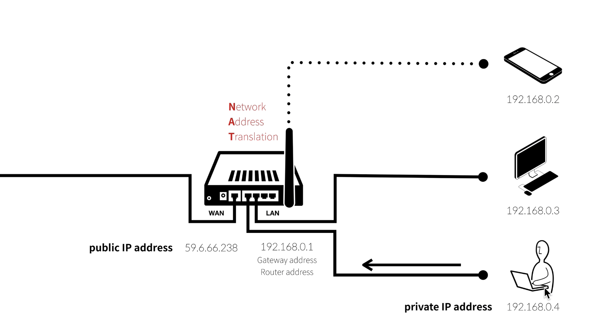

# NAT

network address tranlation

이 기술로 인해 사설 IP를 쓰고 있는 각 컴터들이 외부 인터넷에 접속 가능하다. 192.168.0.4라는 IP를 갖고 있다고 하자. 위키피디아를 접속한다고 해보자. 우리는 무조건 Gateway Addr에게 신호를 보낸다. 공유기가 요청을 받는다. 공유기가 내부 요청인지 확인한다. 아닌 것을 확인하고 요청을 WAN을 통해 외부로 보낸다.

근데 이 전에 2가지 일을 한다.

1. 위키피디아로 가는 요청이 192.168.0.4라는 IP를 가지고 있는 디바이스의 요청이다 라는 것을 공유기에 기록한다. 그래야 나중에 위키피디아의 응답을 줄 수 있다.

2. 요청 IP는 192.168.0.4를 쓰지만 이 주소는 외부에서 접속 불가하다. 그래서 NAT 기술을 통해 요청 IP를 59.6.66.238이라는 public IP 주소로 변경한다.

이 2가지 과정을 거치고요청을 보낸다.

